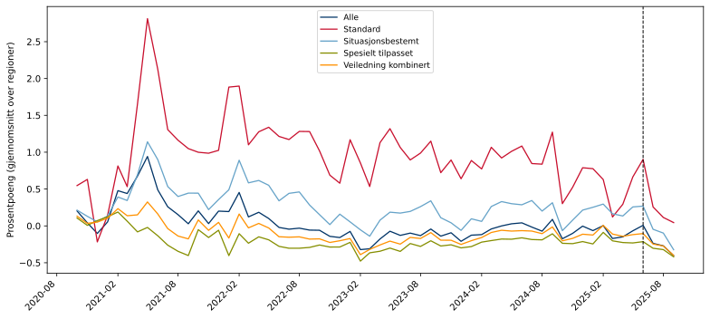
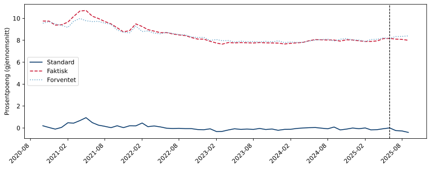
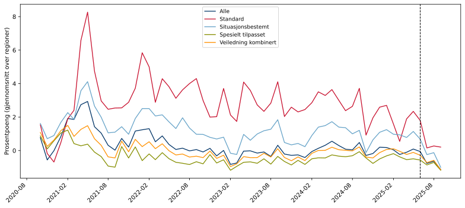
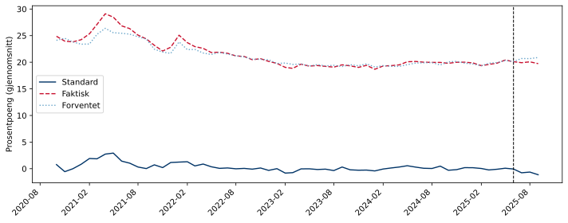

## Om indikatorene

Utfallsmålene i analysene er to indikatorer for overgang til arbeid:

| Indikator | Beskrivelse |
|---|---|
| **atid3** | Andel brukere som er registrert med arbeidstid de neste tre månedene |
| **jobb3** | Andel brukere som er i jobb etter tre måneder |

Begge er tilgjengelige i tre varianter:

| Variant | Beskrivelse |
|---|---|
| Standard (`atid3.csv`) | Ujustert observert verdi |
| Faktisk (`faktisk_atid3.csv`) | Korrigert for forventningseffekter |
| Forventet (`forventet_atid3.csv`) | Modellbasert forventningsverdi |

Tilgjengelig for innsatsgruppene: **Alle**, **Standard**, **Situasjonsbestemt**,
**Spesielt tilpasset** og **Veiledning kombinert**.

Data på regionnivå dekker perioden `202010`–`202509`. Enhetsnivå-data er tilgjengelig fra `202306`.

## Arbeidstid neste tre måneder (atid3)

### Trend per innsatsgruppe

Gjennomsnitt over regioner. Stiplet linje = behandlingsstart.

{fig-align='center' width=95%}

### Faktisk vs. forventet (alle innsatsgrupper)

{fig-align='center' width=95%}

## I jobb etter 3 måneder (jobb3)

### Trend per innsatsgruppe

Gjennomsnitt over regioner. Stiplet linje = behandlingsstart.

{fig-align='center' width=95%}

### Faktisk vs. forventet (alle innsatsgrupper)

{fig-align='center' width=95%}

## Deskriptiv statistikk (pre-periode)

Gjennomsnitt og spredning for pre-perioden per innsatsgruppe og indikator.

|                                   |   Gj.snitt (pre) |   Std.avvik |    Min |   Maks |
|:----------------------------------|-----------------:|------------:|-------:|-------:|
| ('Alle', 'atid3')                 |            0.034 |       0.323 | -1.206 |  1.611 |
| ('Alle', 'jobb3')                 |            0.326 |       1.072 | -3.8   |  4.5   |
| ('Standard', 'atid3')             |            0.973 |       0.824 | -2.745 |  4.807 |
| ('Standard', 'jobb3')             |            2.899 |       2.679 | -8.9   | 12.9   |
| ('Situasjonsbestemt', 'atid3')    |            0.288 |       0.566 | -1.038 |  2.555 |
| ('Situasjonsbestemt', 'jobb3')    |            1.3   |       1.844 | -3.4   |  7.9   |
| ('Spesielt tilpasset', 'atid3')   |           -0.197 |       0.232 | -0.82  |  0.627 |
| ('Spesielt tilpasset', 'jobb3')   |           -0.354 |       0.841 | -2.2   |  2.9   |
| ('Veiledning kombinert', 'atid3') |           -0.083 |       0.246 | -0.745 |  0.764 |
| ('Veiledning kombinert', 'jobb3') |            0.041 |       0.899 | -1.922 |  3.24  |
