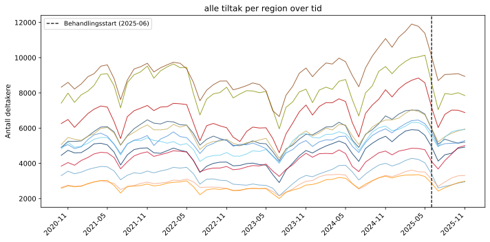
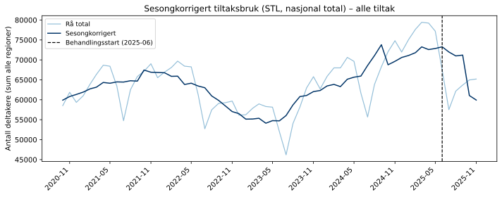
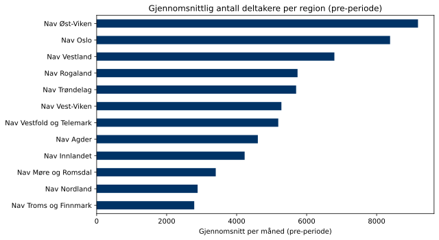
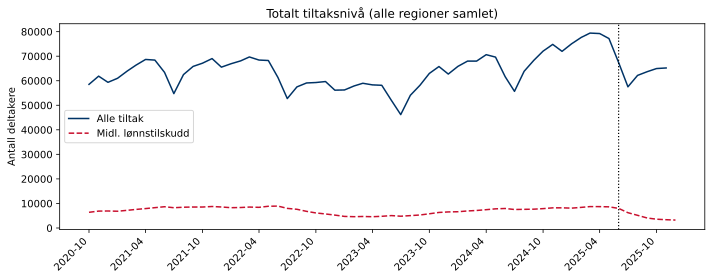

## Om datakilden

**Alle tiltak** er summen av samtlige arbeidsmarkedstiltak Nav tilbyr, inkludert lønnstilskudd, arbeidspraksis, opplæringstiltak og oppfølgingstiltak. Disse dataene gir et bredere bilde av tiltaksaktiviteten enn midlertidig lønnstilskudd alene.

Disse dataene brukes som **behandlingsvariabel** i analysene under *DiD – Alle tiltak*-seksjonen.

| Egenskap | Verdi |
|---|---|
| Kilde | Nav intern statistikk |
| Nivå | Nav-regioner (12 regioner) |
| Frekvens | Månedlig |
| Tidsperiode | 2020-10 – 2025-11 |
| Antall måneder | 62 |

## Tiltaksbruk over tid

Deltakere i *alle tiltak* per region. Stiplet linje = behandlingsstart (2025-06).

{fig-align='center' width=95%}

## Sesongkorrigert tiltaksbruk

Nasjonal total (sum over alle regioner). Sesongkorrigering med STL på log-transformerte verdier (`period=12`, `seasonal=13`, `robust=True`). Fordi den sesongmessige svingningen vokser proporsjonalt med nivået (multiplikativ sesong), passer log-transformasjon bedre enn additiv STL. Den sesongkorrigerte kurven tydeliggjør den strukturelle trenden.

{fig-align='center' width=95%}

## Regional fordeling (pre-periode)

Gjennomsnittlig månedlig deltakerantall per region i perioden før behandlingsstart.

{fig-align='center' width=90%}

## Sammenlikning med midlertidig lønnstilskudd

Totalt tiltaksnivå (sum over alle regioner). Stiplet = behandlingsstart.

{fig-align='center' width=95%}

## Deskriptiv statistikk per region

Gjennomsnittlig deltakerantall per region i pre- og post-perioden.

| region                   |   Gj.snitt post |   Gj.snitt pre |   Endring (pp) |   Endring (%) |
|:-------------------------|----------------:|---------------:|---------------:|--------------:|
| Nav Øst-Viken            |            9150 |           9182 |            -32 |          -0.3 |
| Nav Oslo                 |            7890 |           8384 |           -494 |          -5.9 |
| Nav Vestland             |            6820 |           6793 |             27 |           0.4 |
| Nav Rogaland             |            5335 |           5740 |           -405 |          -7.1 |
| Nav Trøndelag            |            5707 |           5700 |              7 |           0.1 |
| Nav Vest-Viken           |            5239 |           5279 |            -40 |          -0.8 |
| Nav Vestfold og Telemark |            5587 |           5189 |            397 |           7.7 |
| Nav Agder                |            4650 |           4606 |             45 |           1   |
| Nav Innlandet            |            4394 |           4229 |            165 |           3.9 |
| Nav Møre og Romsdal      |            2882 |           3403 |           -521 |         -15.3 |
| Nav Nordland             |            3083 |           2885 |            198 |           6.9 |
| Nav Troms og Finnmark    |            2763 |           2788 |            -25 |          -0.9 |
