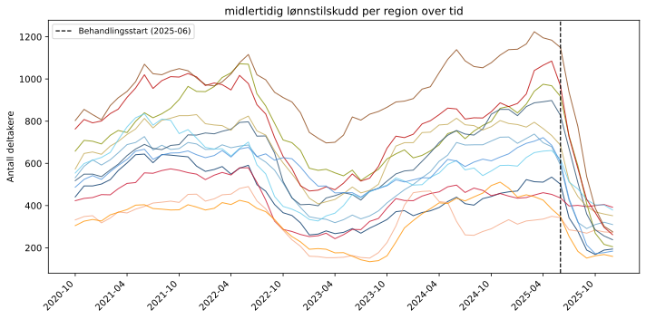
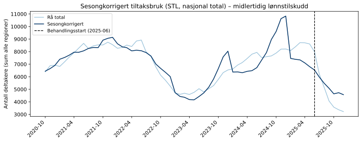
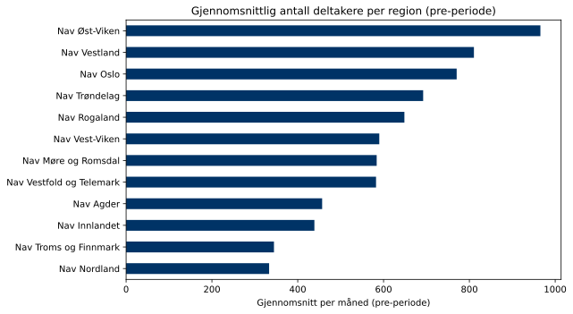

## Om datakilden

**Midlertidig lønnstilskudd** er et tiltak der Nav subsidierer lønnskostnader til arbeidsgivere som ansetter personer med nedsatt arbeidsevne eller som har stått lenge utenfor arbeidsmarkedet. Tiltaket er særlig rettet mot innsatsgruppen *Veiledning kombinert*, og utgjorde en betydelig del av Nav's tiltaksportefølje frem til nedgangen i 2025.

Disse dataene brukes som **behandlingsvariabel** i alle analyser under *DiD – Midlertidig lønnstilskudd* og *TrippelDiD*-seksjonene.

| Egenskap | Verdi |
|---|---|
| Kilde | Nav intern statistikk |
| Nivå | Nav-regioner (12 regioner) |
| Frekvens | Månedlig |
| Tidsperiode | 2020-10 – 2025-12 |
| Antall måneder | 63 |

## Tiltaksbruk over tid

Deltakere i *midlertidig lønnstilskudd* per region. Stiplet linje = behandlingsstart (2025-06).

{fig-align='center' width=95%}

## Sesongkorrigert tiltaksbruk

Nasjonal total (sum over alle regioner). Sesongkorrigering med STL på log-transformerte verdier (`period=12`, `seasonal=13`, `robust=True`). Fordi den sesongmessige svingningen vokser proporsjonalt med nivået (multiplikativ sesong), passer log-transformasjon bedre enn additiv STL. Den sesongkorrigerte kurven tydeliggjør den strukturelle trenden.

{fig-align='center' width=95%}

## Regional fordeling (pre-periode)

Gjennomsnittlig månedlig deltakerantall per region i perioden før behandlingsstart.

{fig-align='center' width=90%}

## Deskriptiv statistikk per region

Gjennomsnittlig deltakerantall per region i pre- og post-perioden.

| region                   |   Gj.snitt post |   Gj.snitt pre |   Endring (pp) |   Endring (%) |
|:-------------------------|----------------:|---------------:|---------------:|--------------:|
| Nav Øst-Viken            |             624 |            966 |           -342 |         -35.4 |
| Nav Vestland             |             518 |            811 |           -293 |         -36.1 |
| Nav Oslo                 |             476 |            770 |           -294 |         -38.2 |
| Nav Trøndelag            |             446 |            692 |           -246 |         -35.5 |
| Nav Rogaland             |             449 |            649 |           -199 |         -30.7 |
| Nav Vest-Viken           |             301 |            590 |           -289 |         -49   |
| Nav Møre og Romsdal      |             367 |            584 |           -217 |         -37.2 |
| Nav Vestfold og Telemark |             460 |            582 |           -122 |         -20.9 |
| Nav Agder                |             266 |            457 |           -191 |         -41.8 |
| Nav Innlandet            |             404 |            439 |            -35 |          -8   |
| Nav Troms og Finnmark    |             203 |            345 |           -141 |         -40.9 |
| Nav Nordland             |             287 |            333 |            -46 |         -13.8 |
