| Egenskap | Verdi |
|---|---|
| Behandlingstype | Kontinuerlig |
| Behandlingsstart | 2025-06 |
| Tiltaksdata | Alle tiltak |
| Variasjon i behandling | Nav-regioner |
| Undergruppe (populasjon) | Alle |
| Utfallsmål (indikatortype) | — |
| Indikatorer | atid3 — Arbeidstid neste tre måneder, jobb3 — I jobb etter 3 måneder |

## Bakgrunn og metode

Denne rapporten analyserer om nedgangen i *Alle tiltak* fra og med 2025-06 har hatt målbar effekt på Nav-indikatorer for overgang til arbeid.

Analysen bruker en *difference-in-differences*-tilnærming med **kontinuerlig behandling**. Behandlingsvariabelen (`tiltaksnedgang`) måler hvor mye nivået av *Alle tiltak* i en region har falt relativt til toppen i pre-perioden, og varierer kontinuerlig mellom 0 (ingen nedgang) og 1 (full nedgang). Modellen inkluderer region-faste effekter og tidspunkt-faste effekter for å kontrollere for tidsinvariante regionforskjeller og felles nasjonale trender.

To modellspesifikasjoner estimeres:

- **Basis:** Ujustert indikator, region FE + år-måned FE
- **Sesongjustert:** Sesongjustert indikator, region FE + år-måned FE

> **Signifikansnivå:** \* p < 0,10 &nbsp; \*\* p < 0,05 &nbsp; \*\*\* p < 0,01
> Standardfeil er clustret på regionnivå (CR1 småutvalgskorrigering).
> Med kun G = 12 regioner er asymptotisk clusterinferens upålitelig; primær p-verdi er basert på wild cluster bootstrap med Webb-vekter (B = 4 999).

## Tiltaksbruk over tid

Tiltaksbruk (Alle tiltak) per region over tid. Den stiplede linjen markerer behandlingsstart.

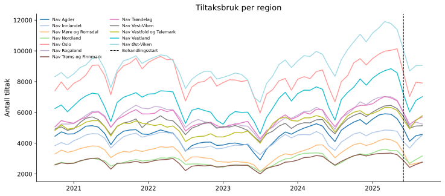{fig-align='center' width=95%}

## Arbeidstid neste tre måneder (`atid3`)

### Deskriptiv statistikk

|                      |   Gjennomsnitt |   Std.avvik |      Min |      Maks |
|:---------------------|---------------:|------------:|---------:|----------:|
| atid3                |          0.077 |       0.731 |   -3.431 |     6.092 |
| Tiltaksnedgang (0–1) |          0.012 |       0.049 |    0     |     0.355 |
| Tiltak (antall)      |       5366.42  |    2112.22  | 2003     | 11907     |

**Behandlingsvariabel per region (gjennomsnitt i post-perioden):**

| Region                   |   Gj.snitt nedgang (0–1) |
|:-------------------------|-------------------------:|
| Nav Møre og Romsdal      |                    0.289 |
| Nav Oslo                 |                    0.224 |
| Nav Vestland             |                    0.212 |
| Nav Rogaland             |                    0.203 |
| Nav Øst-Viken            |                    0.19  |
| Nav Agder                |                    0.19  |
| Nav Troms og Finnmark    |                    0.179 |
| Nav Trøndelag            |                    0.169 |
| Nav Vest-Viken           |                    0.161 |
| Nav Nordland             |                    0.152 |
| Nav Innlandet            |                    0.138 |
| Nav Vestfold og Telemark |                    0.114 |

### Trender over tid

Regionene er delt i to grupper basert på median behandlingsintensitet (gjennomsnittlig tiltaksnedgang i post-perioden).

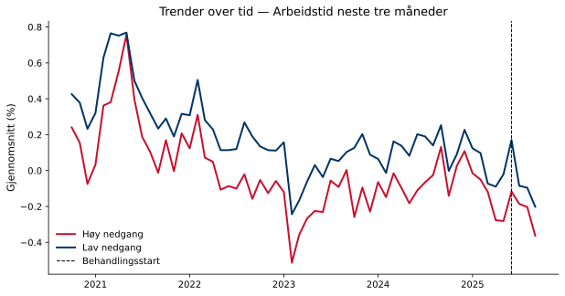{fig-align='center' width=90%}

### Regresjonsresultater

Koeffisienten for behandlingsvariabelen angir estimert effekt av å gå fra null til full tiltaksnedgang (behandlingsintensitet = 1) på indikatoren, i prosentpoeng. Et positivt fortegn betyr at regioner med større tiltaksnedgang hadde høyere indikatorverdier i post-perioden sammenlignet med kontrafaktum; et negativt fortegn betyr lavere verdier. Størrelsen angir den absolutte endringen i prosentpoeng ved full tiltaksnedgang. Signifikansstjerner og primær p-verdi basert på wild cluster bootstrap (Webb-vekter, G = 12, B = 4,999).

| Modell        | Koeffisient   |   Std.feil (CR1) |   t-stat |   p (bootstrap) |   p (asymptotisk) | 95% KI            |   Obs. |   Clustere |
|:--------------|:--------------|-----------------:|---------:|----------------:|------------------:|:------------------|-------:|-----------:|
| Basis         | 1.1020*       |           0.3433 |    3.21  |           0.091 |            0.0083 | [0.3463, 1.8577]  |  14837 |         12 |
| Sesongjustert | 0.2415        |           0.3358 |    0.719 |           0.499 |            0.4871 | [-0.4977, 0.9807] |  14837 |         12 |

> **Signifikansnivå (bootstrap):** \* p < 0,10 &nbsp; \*\* p < 0,05 &nbsp; \*\*\* p < 0,01

**Gjennomsnittlig pre-periode-nivå:** 0.1 % — koeffisienten tilsvarer en relativ endring på 260.6 %.
**Minimum detekterbar effekt (80 % styrke, α = 0,05):** ±1.03 pp.

### Bootstrap-fordeling

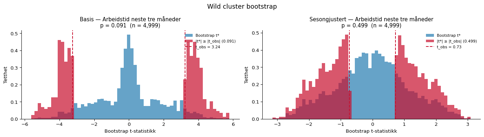{fig-align='center' width=95%}

### Faste effekter

Stolpediagrammene viser koeffisientene for de faste effektene i den sesongjusterte modellen. Røde søyler er signifikante på 5 %-nivå.

**Entitet FE**

{fig-align='center' width=90%}

**Tidspunkt FE**

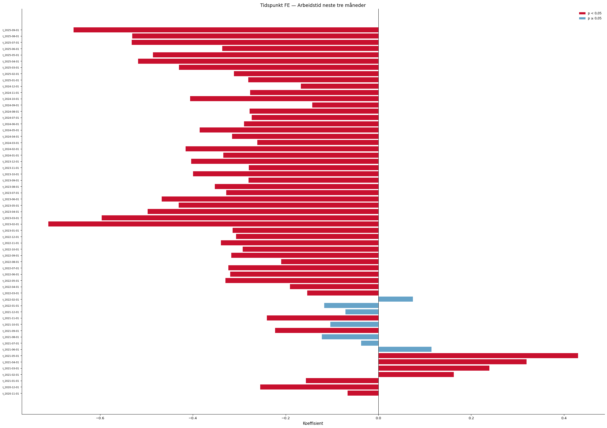{fig-align='center' width=90%}

### Eventstudie og parallell-trend-test

Eventsstudien samhandler periodevise indikatorer med en tidsinvariant intensitetsscore per region (maksimal tiltaksnedgang i post-perioden). Pre-periode-koeffisientene (τ < 0) bør ligge nær null dersom parallelle trender holder. Blå = basis, rød = sesongjustert modell.

**Advarsel:** pre-trend-testen er signifikant (F(11,11) = 357.27, p = 0.000), noe som svekker DiD-antakelsen.

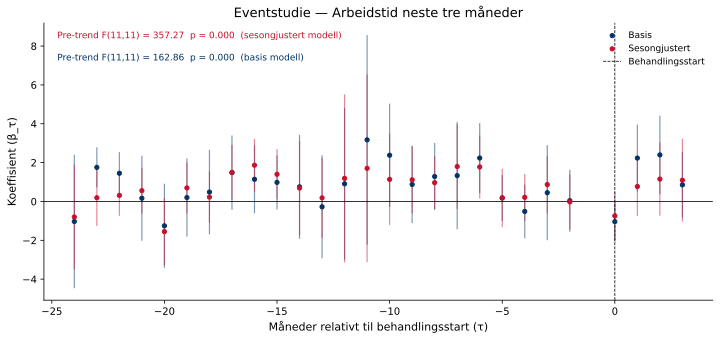{fig-align='center' width=95%}

### Placebotest (τ = −12)

Begge modeller re-estimeres med en falsk behandlingsstart tolv måneder tidligere, utelukkende i pre-perioden. Estimater nær null styrker antakelsen om at resultatene ikke skyldes pre-eksisterende trender.

Sesongjustert modell — placebo-koeffisienten er -1.2401 (p = 0.235). Dette er ikke signifikant, noe som styrker identifikasjonsstrategien.

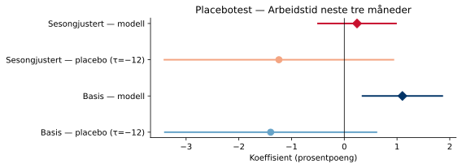{fig-align='center' width=80%}

### Leave-one-out robusthet

Begge modeller re-estimeres tolv ganger, én for hver region som droppes. Det skyggelagte feltet viser 95 %-konfidensintervallet for full-utvalgsmodellen.

Sesongjustert modell: koeffisienten varierer mellom -0.0046 til 0.4397 når én region utelates.

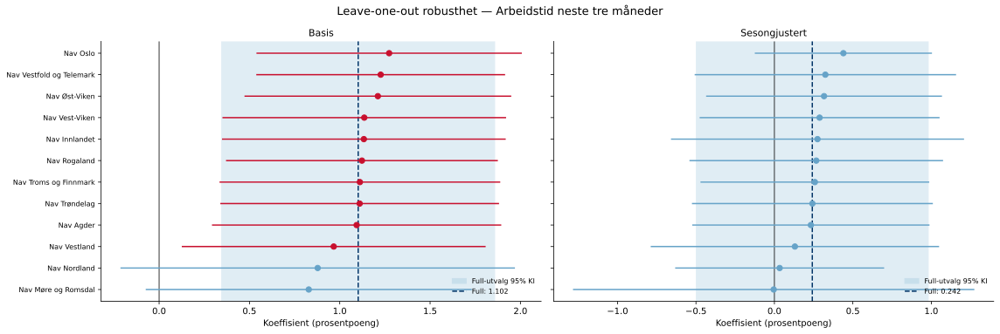{fig-align='center' width=95%}

## I jobb etter 3 måneder (`jobb3`)

### Deskriptiv statistikk

|                      |   Gjennomsnitt |   Std.avvik |      Min |      Maks |
|:---------------------|---------------:|------------:|---------:|----------:|
| jobb3                |          0.437 |       2.639 |  -14.566 |    19.091 |
| Tiltaksnedgang (0–1) |          0.012 |       0.049 |    0     |     0.355 |
| Tiltak (antall)      |       5366.42  |    2112.22  | 2003     | 11907     |

**Behandlingsvariabel per region (gjennomsnitt i post-perioden):**

| Region                   |   Gj.snitt nedgang (0–1) |
|:-------------------------|-------------------------:|
| Nav Møre og Romsdal      |                    0.289 |
| Nav Oslo                 |                    0.224 |
| Nav Vestland             |                    0.212 |
| Nav Rogaland             |                    0.203 |
| Nav Øst-Viken            |                    0.19  |
| Nav Agder                |                    0.19  |
| Nav Troms og Finnmark    |                    0.179 |
| Nav Trøndelag            |                    0.169 |
| Nav Vest-Viken           |                    0.161 |
| Nav Nordland             |                    0.152 |
| Nav Innlandet            |                    0.138 |
| Nav Vestfold og Telemark |                    0.114 |

### Trender over tid

Regionene er delt i to grupper basert på median behandlingsintensitet (gjennomsnittlig tiltaksnedgang i post-perioden).

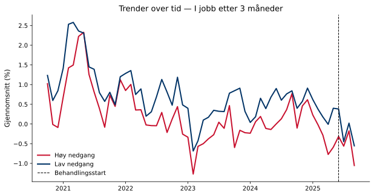{fig-align='center' width=90%}

### Regresjonsresultater

Koeffisienten for behandlingsvariabelen angir estimert effekt av å gå fra null til full tiltaksnedgang (behandlingsintensitet = 1) på indikatoren, i prosentpoeng. Et positivt fortegn betyr at regioner med større tiltaksnedgang hadde høyere indikatorverdier i post-perioden sammenlignet med kontrafaktum; et negativt fortegn betyr lavere verdier. Størrelsen angir den absolutte endringen i prosentpoeng ved full tiltaksnedgang. Signifikansstjerner og primær p-verdi basert på wild cluster bootstrap (Webb-vekter, G = 12, B = 4,999).

| Modell        |   Koeffisient |   Std.feil (CR1) |   t-stat |   p (bootstrap) |   p (asymptotisk) | 95% KI            |   Obs. |   Clustere |
|:--------------|--------------:|-----------------:|---------:|----------------:|------------------:|:------------------|-------:|-----------:|
| Basis         |        4.6092 |           1.7438 |    2.643 |           0.2   |            0.0229 | [0.7711, 8.4474]  |  14837 |         12 |
| Sesongjustert |        1.9093 |           1.8578 |    1.028 |           0.461 |            0.3261 | [-2.1796, 5.9982] |  14837 |         12 |

> **Signifikansnivå (bootstrap):** \* p < 0,10 &nbsp; \*\* p < 0,05 &nbsp; \*\*\* p < 0,01

**Gjennomsnittlig pre-periode-nivå:** 0.5 % — koeffisienten tilsvarer en relativ endring på 387.6 %.
**Minimum detekterbar effekt (80 % styrke, α = 0,05):** ±5.72 pp.

### Bootstrap-fordeling

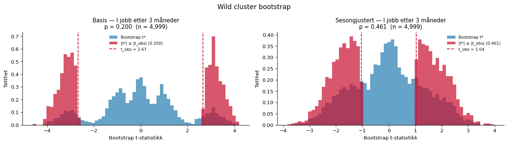{fig-align='center' width=95%}

### Faste effekter

Stolpediagrammene viser koeffisientene for de faste effektene i den sesongjusterte modellen. Røde søyler er signifikante på 5 %-nivå.

**Entitet FE**

{fig-align='center' width=90%}

**Tidspunkt FE**

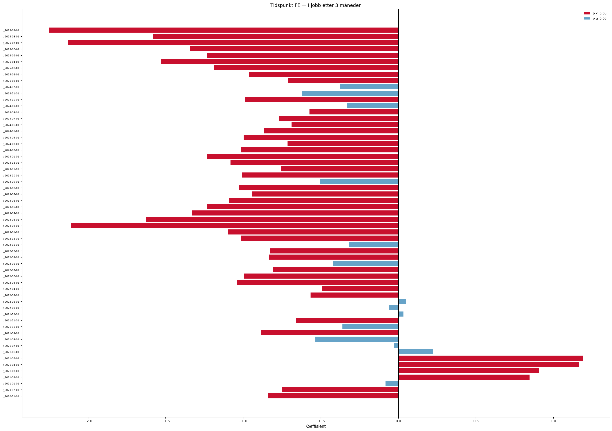{fig-align='center' width=90%}

### Eventstudie og parallell-trend-test

Eventsstudien samhandler periodevise indikatorer med en tidsinvariant intensitetsscore per region (maksimal tiltaksnedgang i post-perioden). Pre-periode-koeffisientene (τ < 0) bør ligge nær null dersom parallelle trender holder. Blå = basis, rød = sesongjustert modell.

**Advarsel:** pre-trend-testen er signifikant (F(11,11) = 386.48, p = 0.000), noe som svekker DiD-antakelsen.

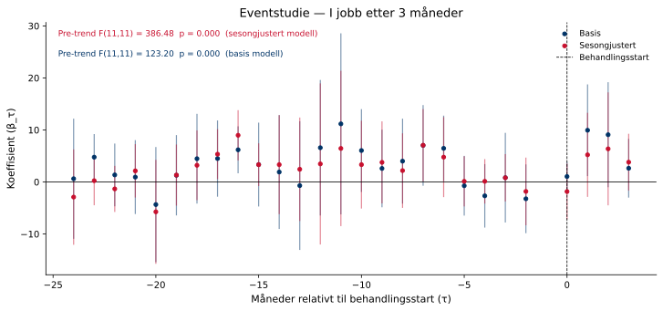{fig-align='center' width=95%}

### Placebotest (τ = −12)

Begge modeller re-estimeres med en falsk behandlingsstart tolv måneder tidligere, utelukkende i pre-perioden. Estimater nær null styrker antakelsen om at resultatene ikke skyldes pre-eksisterende trender.

Sesongjustert modell — placebo-koeffisienten er -5.4988 (p = 0.124). Dette er ikke signifikant, noe som styrker identifikasjonsstrategien.

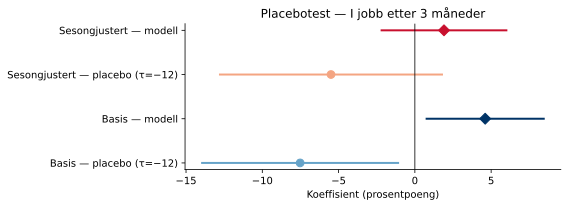{fig-align='center' width=80%}

### Leave-one-out robusthet

Begge modeller re-estimeres tolv ganger, én for hver region som droppes. Det skyggelagte feltet viser 95 %-konfidensintervallet for full-utvalgsmodellen.

Sesongjustert modell: koeffisienten varierer mellom -0.0213 til 2.6690 når én region utelates.

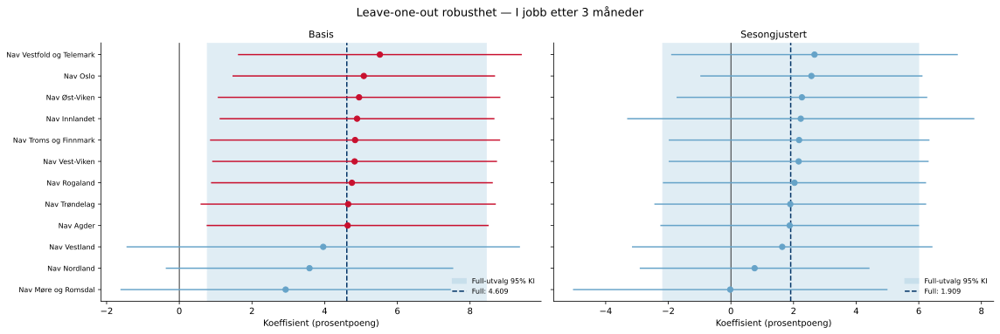{fig-align='center' width=95%}

---

*Rapporten er automatisk generert av analysepipelinen.*
