| Egenskap | Verdi |
|---|---|
| Behandlingstype | Diskret |
| Behandlingsstart | 2025-06 |
| Tiltaksdata | Alle tiltak |
| Variasjon i behandling | Nav-regioner |
| Undergruppe (populasjon) | Spesielt_tilpasset |
| Utfallsmål (indikatortype) | Forventet |
| Indikatorer | atid3 — Arbeidstid neste tre måneder, jobb3 — I jobb etter 3 måneder |
| Kontrollregioner | Nav Innlandet, Nav Nordland |

## Bakgrunn og metode

Denne rapporten analyserer om nedgangen i *Alle tiltak* fra og med 2025-06 har hatt målbar effekt på Nav-indikatorer for overgang til arbeid.

Analysen bruker en *difference-in-differences*-tilnærming med **diskret behandling**. Behandlingsvariabelen er binær: 1 for behandlede regioner i post-perioden, 0 ellers. Kontrollregioner: Nav Innlandet, Nav Nordland. Alle øvrige regioner klassifiseres som behandlede. Modellen inkluderer region-faste effekter og tidspunkt-faste effekter for å kontrollere for tidsinvariante regionforskjeller og felles nasjonale trender.

To modellspesifikasjoner estimeres:

- **Basis:** Ujustert indikator, region FE + år-måned FE
- **Sesongjustert:** Sesongjustert indikator, region FE + år-måned FE

> **Signifikansnivå:** \* p < 0,10 &nbsp; \*\* p < 0,05 &nbsp; \*\*\* p < 0,01  
> Standardfeil er clustret på regionnivå (CR1 småutvalgskorrigering).  
> Med kun G = 12 regioner er asymptotisk clusterinferens upålitelig; primær p-verdi er basert på wild cluster bootstrap med Webb-vekter (B = 4 999).

## Tiltaksbruk over tid

Tiltaksbruk (Alle tiltak) per region over tid. Den stiplede linjen markerer behandlingsstart.

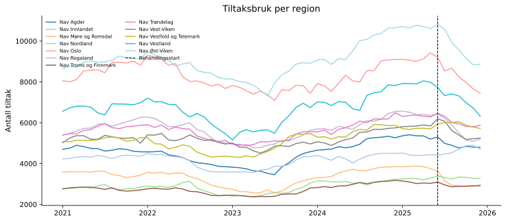{fig-align='center' width=95%}

## Arbeidstid neste tre måneder (`atid3`)

### Deskriptiv statistikk

|                 |   Gjennomsnitt |   Std.avvik |      Min |      Maks |
|:----------------|---------------:|------------:|---------:|----------:|
| atid3           |          7.375 |       1.384 |    1.204 |    14.143 |
| Behandlet (0/1) |          0.094 |       0.292 |    0     |     1     |
| Tiltak (antall) |       5360.4   |    2074.55  | 2369.59  | 10816.6   |

**Behandlingsvariabel per region (gjennomsnitt i post-perioden):**

| Region                   |   Behandlet (0=kontroll, 1=behandlet) |
|:-------------------------|--------------------------------------:|
| Nav Agder                |                                     1 |
| Nav Møre og Romsdal      |                                     1 |
| Nav Oslo                 |                                     1 |
| Nav Rogaland             |                                     1 |
| Nav Troms og Finnmark    |                                     1 |
| Nav Trøndelag            |                                     1 |
| Nav Vest-Viken           |                                     1 |
| Nav Vestfold og Telemark |                                     1 |
| Nav Vestland             |                                     1 |
| Nav Øst-Viken            |                                     1 |
| Nav Innlandet            |                                     0 |
| Nav Nordland             |                                     0 |

### Trender over tid

Regionene er delt inn i behandlet og kontrollgruppe.

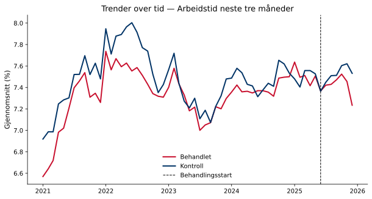{fig-align='center' width=90%}

### Regresjonsresultater

Koeffisienten for behandlingsvariabelen angir estimert gjennomsnittlig behandlingseffekt (ATT) på indikatoren, i prosentpoeng. Et positivt fortegn betyr at behandlede regioner hadde en høyere verdi på indikatoren i post-perioden sammenlignet med kontrafaktum; et negativt fortegn betyr lavere verdi. Størrelsen angir den absolutte endringen i prosentpoeng. Signifikansstjerner og primær p-verdi basert på wild cluster bootstrap (Webb-vekter, G = 12, B = 4,999).

| Modell        |   Koeffisient |   Std.feil (CR1) |   t-stat |   p (bootstrap) |   p (asymptotisk) | 95% KI            |   Obs. |   Clustere |
|:--------------|--------------:|-----------------:|---------:|----------------:|------------------:|:------------------|-------:|-----------:|
| Basis         |        0.0031 |           0.1229 |    0.025 |           0.976 |            0.9803 | [-0.2675, 0.2737] |  14370 |         12 |
| Sesongjustert |        0.042  |           0.142  |    0.296 |           0.76  |            0.7728 | [-0.2704, 0.3544] |  14369 |         12 |

> **Signifikansnivå (bootstrap):** \* p < 0,10 &nbsp; \*\* p < 0,05 &nbsp; \*\*\* p < 0,01

**Gjennomsnittlig pre-periode-nivå:** 7.4 % — koeffisienten tilsvarer en relativ endring på 0.6 %.  
**Minimum detekterbar effekt (80 % styrke, α = 0,05):** ±0.44 pp.

### Bootstrap-fordeling

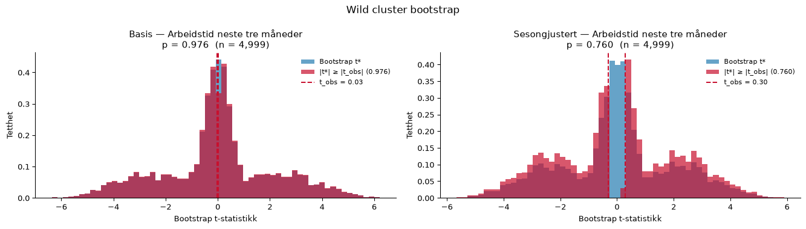{fig-align='center' width=95%}

### Faste effekter

Stolpediagrammene viser koeffisientene for de faste effektene i den sesongjusterte modellen. Røde søyler er signifikante på 5 %-nivå.

**Entitet FE**

{fig-align='center' width=90%}

**Tidspunkt FE**

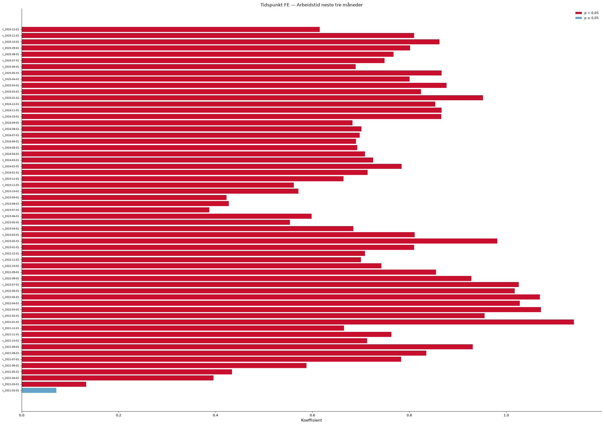{fig-align='center' width=90%}

### Eventstudie og parallell-trend-test

Eventsstudien samhandler periodevise indikatorer med en tidsinvariant behandlingindikator per region (0 = kontroll, 1 = behandlet). Pre-periode-koeffisientene (τ < 0) bør ligge nær null dersom parallelle trender holder. Blå = basis, rød = sesongjustert modell.

**Advarsel:** pre-trend-testen er signifikant (F(10,11) = 5.39, p = 0.005), noe som svekker DiD-antakelsen.

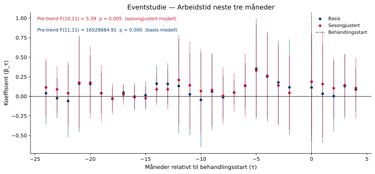{fig-align='center' width=95%}

### Placebotest (τ = −12)

Begge modeller re-estimeres med en falsk behandlingsstart tolv måneder tidligere, utelukkende i pre-perioden. Estimater nær null styrker antakelsen om at resultatene ikke skyldes pre-eksisterende trender.

Sesongjustert modell — placebo-koeffisienten er -0.8510 (p = 0.752). Dette er ikke signifikant, noe som styrker identifikasjonsstrategien.

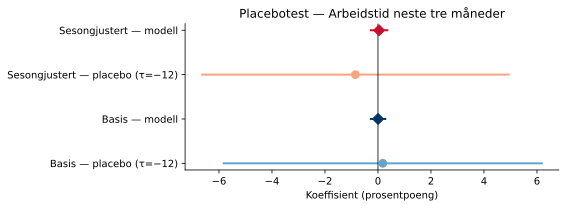{fig-align='center' width=80%}

### Leave-one-out robusthet

Begge modeller re-estimeres tolv ganger, én for hver region som droppes. Det skyggelagte feltet viser 95 %-konfidensintervallet for full-utvalgsmodellen.

Sesongjustert modell: koeffisienten varierer mellom -0.1148 til 0.2537 når én region utelates.

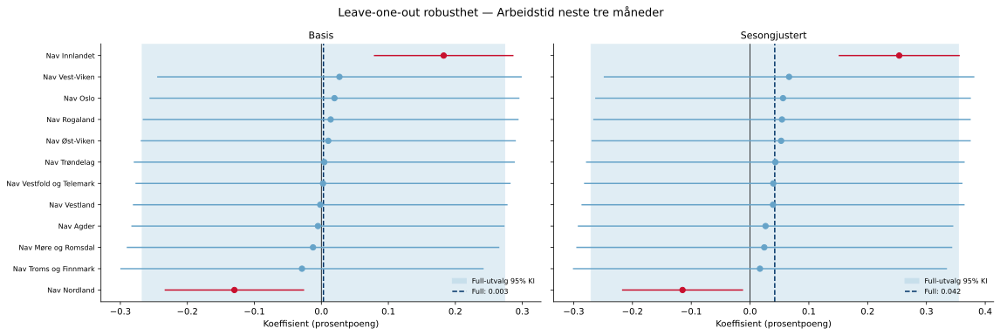{fig-align='center' width=95%}

## I jobb etter 3 måneder (`jobb3`)

### Deskriptiv statistikk

|                 |   Gjennomsnitt |   Std.avvik |     Min |     Maks |
|:----------------|---------------:|------------:|--------:|---------:|
| jobb3           |         17.056 |       3.189 |    2.49 |    33.69 |
| Behandlet (0/1) |          0.094 |       0.292 |    0    |     1    |
| Tiltak (antall) |       5360.4   |    2074.55  | 2369.59 | 10816.6  |

**Behandlingsvariabel per region (gjennomsnitt i post-perioden):**

| Region                   |   Behandlet (0=kontroll, 1=behandlet) |
|:-------------------------|--------------------------------------:|
| Nav Agder                |                                     1 |
| Nav Møre og Romsdal      |                                     1 |
| Nav Oslo                 |                                     1 |
| Nav Rogaland             |                                     1 |
| Nav Troms og Finnmark    |                                     1 |
| Nav Trøndelag            |                                     1 |
| Nav Vest-Viken           |                                     1 |
| Nav Vestfold og Telemark |                                     1 |
| Nav Vestland             |                                     1 |
| Nav Øst-Viken            |                                     1 |
| Nav Innlandet            |                                     0 |
| Nav Nordland             |                                     0 |

### Trender over tid

Regionene er delt inn i behandlet og kontrollgruppe.

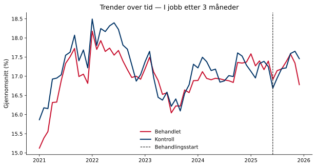{fig-align='center' width=90%}

### Regresjonsresultater

Koeffisienten for behandlingsvariabelen angir estimert gjennomsnittlig behandlingseffekt (ATT) på indikatoren, i prosentpoeng. Et positivt fortegn betyr at behandlede regioner hadde en høyere verdi på indikatoren i post-perioden sammenlignet med kontrafaktum; et negativt fortegn betyr lavere verdi. Størrelsen angir den absolutte endringen i prosentpoeng. Signifikansstjerner og primær p-verdi basert på wild cluster bootstrap (Webb-vekter, G = 12, B = 4,999).

| Modell        |   Koeffisient |   Std.feil (CR1) |   t-stat |   p (bootstrap) |   p (asymptotisk) | 95% KI            |   Obs. |   Clustere |
|:--------------|--------------:|-----------------:|---------:|----------------:|------------------:|:------------------|-------:|-----------:|
| Basis         |        0.0538 |           0.214  |    0.251 |           0.819 |            0.8061 | [-0.4172, 0.5248] |  14370 |         12 |
| Sesongjustert |        0.1621 |           0.2551 |    0.636 |           0.645 |            0.5381 | [-0.3994, 0.7236] |  14369 |         12 |

> **Signifikansnivå (bootstrap):** \* p < 0,10 &nbsp; \*\* p < 0,05 &nbsp; \*\*\* p < 0,01

**Gjennomsnittlig pre-periode-nivå:** 17.0 % — koeffisienten tilsvarer en relativ endring på 1.0 %.  
**Minimum detekterbar effekt (80 % styrke, α = 0,05):** ±0.78 pp.

### Bootstrap-fordeling

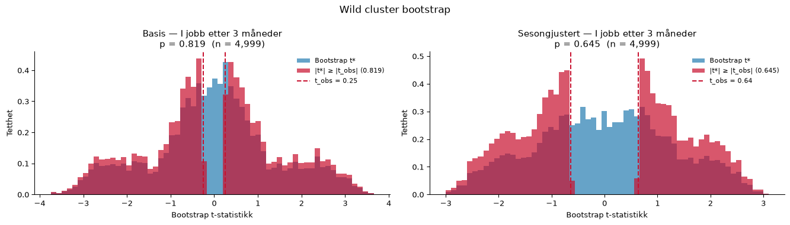{fig-align='center' width=95%}

### Faste effekter

Stolpediagrammene viser koeffisientene for de faste effektene i den sesongjusterte modellen. Røde søyler er signifikante på 5 %-nivå.

**Entitet FE**

{fig-align='center' width=90%}

**Tidspunkt FE**

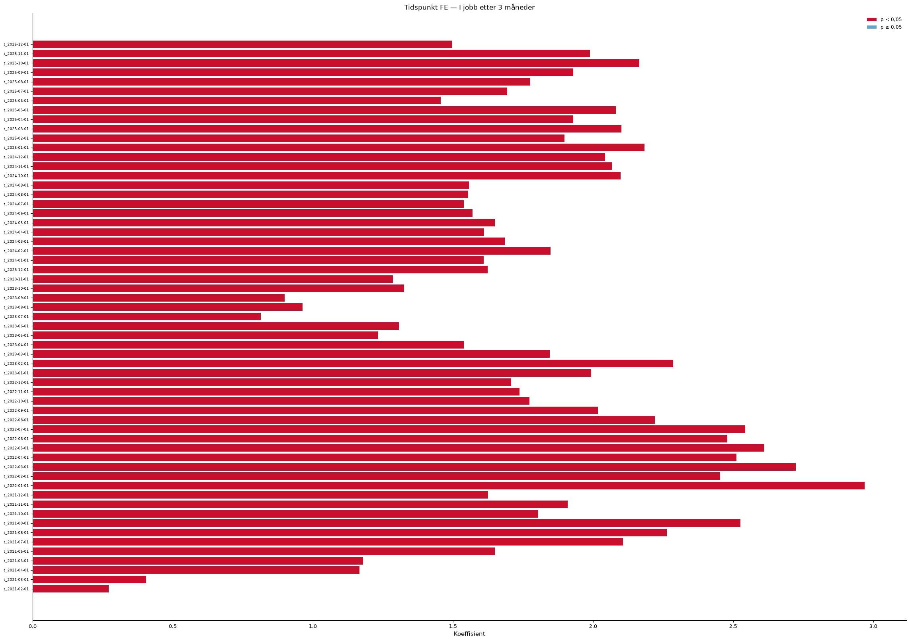{fig-align='center' width=90%}

### Eventstudie og parallell-trend-test

Eventsstudien samhandler periodevise indikatorer med en tidsinvariant behandlingindikator per region (0 = kontroll, 1 = behandlet). Pre-periode-koeffisientene (τ < 0) bør ligge nær null dersom parallelle trender holder. Blå = basis, rød = sesongjustert modell.

**Advarsel:** pre-trend-testen er signifikant (F(11,11) = 431282.93, p = 0.000), noe som svekker DiD-antakelsen.

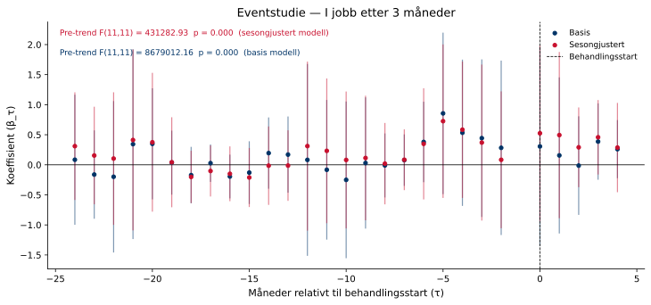{fig-align='center' width=95%}

### Placebotest (τ = −12)

Begge modeller re-estimeres med en falsk behandlingsstart tolv måneder tidligere, utelukkende i pre-perioden. Estimater nær null styrker antakelsen om at resultatene ikke skyldes pre-eksisterende trender.

Sesongjustert modell — placebo-koeffisienten er -0.7496 (p = 0.908). Dette er ikke signifikant, noe som styrker identifikasjonsstrategien.

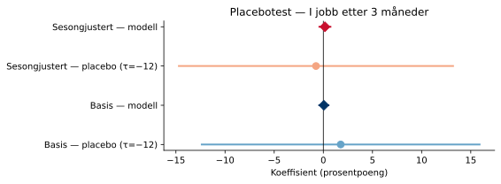{fig-align='center' width=80%}

### Leave-one-out robusthet

Begge modeller re-estimeres tolv ganger, én for hver region som droppes. Det skyggelagte feltet viser 95 %-konfidensintervallet for full-utvalgsmodellen.

Sesongjustert modell: koeffisienten varierer mellom -0.1027 til 0.5196 når én region utelates.

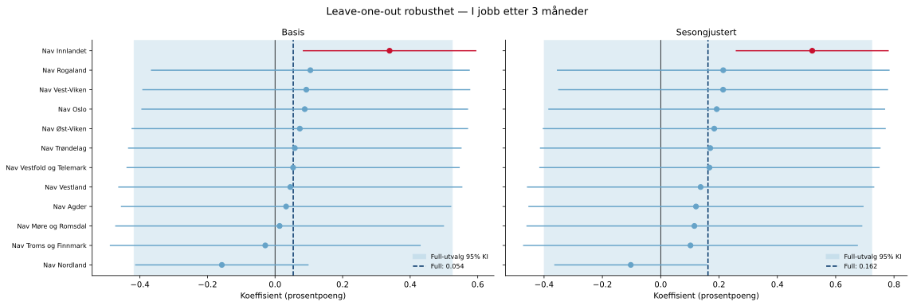{fig-align='center' width=95%}

---

*Rapporten er automatisk generert av analysepipelinen.*
