| Egenskap | Verdi |
|---|---|
| Behandlingstype | Kontinuerlig |
| Behandlingsstart | 2025-06 |
| Tiltaksdata | Alle tiltak |
| Variasjon i behandling | Nav-regioner |
| Undergruppe (populasjon) | Veiledning_kombinert |
| Utfallsmål (indikatortype) | Faktisk |
| Indikatorer | atid3 — Arbeidstid neste tre måneder, jobb3 — I jobb etter 3 måneder |

## Bakgrunn og metode

Denne rapporten analyserer om nedgangen i *Alle tiltak* fra og med 2025-06 har hatt målbar effekt på Nav-indikatorer for overgang til arbeid.

Analysen bruker en *difference-in-differences*-tilnærming med **kontinuerlig behandling**. Behandlingsvariabelen (`tiltaksnedgang`) måler hvor mye nivået av *Alle tiltak* i en region har falt relativt til toppen i pre-perioden, og varierer kontinuerlig mellom 0 (ingen nedgang) og 1 (full nedgang). Modellen inkluderer region-faste effekter og tidspunkt-faste effekter for å kontrollere for tidsinvariante regionforskjeller og felles nasjonale trender.

To modellspesifikasjoner estimeres:

- **Basis:** Ujustert indikator, region FE + år-måned FE
- **Sesongjustert:** Sesongjustert indikator, region FE + år-måned FE

> **Signifikansnivå:** \* p < 0,10 &nbsp; \*\* p < 0,05 &nbsp; \*\*\* p < 0,01  
> Standardfeil er clustret på regionnivå (CR1 småutvalgskorrigering).  
> Med kun G = 12 regioner er asymptotisk clusterinferens upålitelig; primær p-verdi er basert på wild cluster bootstrap med Webb-vekter (B = 4 999).

## Tiltaksbruk over tid

Tiltaksbruk (Alle tiltak) per region over tid. Den stiplede linjen markerer behandlingsstart.

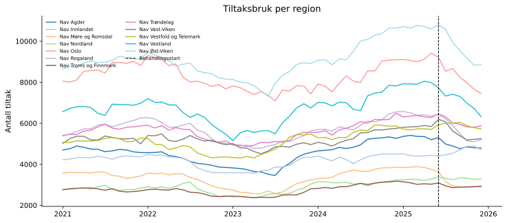{fig-align='center' width=95%}

## Arbeidstid neste tre måneder (`atid3`)

### Deskriptiv statistikk

|                      |   Gjennomsnitt |   Std.avvik |      Min |      Maks |
|:---------------------|---------------:|------------:|---------:|----------:|
| atid3                |          8.075 |       1.467 |    2.797 |    17.503 |
| Tiltaksnedgang (0–1) |          0.008 |       0.033 |    0     |     0.234 |
| Tiltak (antall)      |       5438.12  |    2065.21  | 2369.59  | 10816.6   |

**Behandlingsvariabel per region (gjennomsnitt i post-perioden):**

| Region                   |   Gj.snitt nedgang (0–1) |
|:-------------------------|-------------------------:|
| Nav Møre og Romsdal      |                    0.187 |
| Nav Oslo                 |                    0.125 |
| Nav Rogaland             |                    0.113 |
| Nav Vestland             |                    0.109 |
| Nav Øst-Viken            |                    0.091 |
| Nav Vest-Viken           |                    0.062 |
| Nav Agder                |                    0.058 |
| Nav Trøndelag            |                    0.044 |
| Nav Troms og Finnmark    |                    0.036 |
| Nav Nordland             |                    0.003 |
| Nav Innlandet            |                    0.001 |
| Nav Vestfold og Telemark |                    0     |

### Trender over tid

Regionene er delt i to grupper basert på median behandlingsintensitet (gjennomsnittlig tiltaksnedgang i post-perioden).

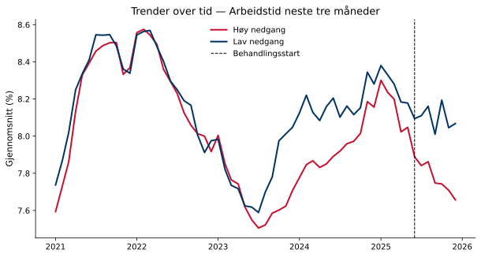{fig-align='center' width=90%}

### Regresjonsresultater

Koeffisienten for behandlingsvariabelen angir estimert effekt av å gå fra null til full tiltaksnedgang (behandlingsintensitet = 1) på indikatoren, i prosentpoeng. Et positivt fortegn betyr at regioner med større tiltaksnedgang hadde høyere indikatorverdier i post-perioden sammenlignet med kontrafaktum; et negativt fortegn betyr lavere verdier. Størrelsen angir den absolutte endringen i prosentpoeng ved full tiltaksnedgang. Signifikansstjerner og primær p-verdi basert på wild cluster bootstrap (Webb-vekter, G = 12, B = 4,999).

| Modell        | Koeffisient   |   Std.feil (CR1) |   t-stat |   p (bootstrap) |   p (asymptotisk) | 95% KI            |   Obs. |   Clustere |
|:--------------|:--------------|-----------------:|---------:|----------------:|------------------:|:------------------|-------:|-----------:|
| Basis         | -0.5954       |           0.5713 |   -1.042 |           0.311 |            0.3197 | [-1.8529, 0.6621] |  12928 |         12 |
| Sesongjustert | -1.2458**     |           0.6284 |   -1.983 |           0.039 |            0.073  | [-2.6289, 0.1373] |  12885 |         12 |

> **Signifikansnivå (bootstrap):** \* p < 0,10 &nbsp; \*\* p < 0,05 &nbsp; \*\*\* p < 0,01

**Gjennomsnittlig pre-periode-nivå:** 8.1 % — koeffisienten tilsvarer en relativ endring på -15.4 %.  
**Minimum detekterbar effekt (80 % styrke, α = 0,05):** ±1.93 pp.

### Bootstrap-fordeling

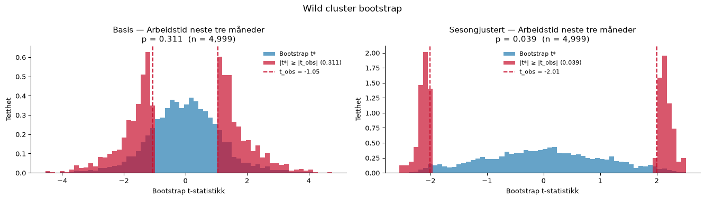{fig-align='center' width=95%}

### Faste effekter

Stolpediagrammene viser koeffisientene for de faste effektene i den sesongjusterte modellen. Røde søyler er signifikante på 5 %-nivå.

**Entitet FE**

{fig-align='center' width=90%}

**Tidspunkt FE**

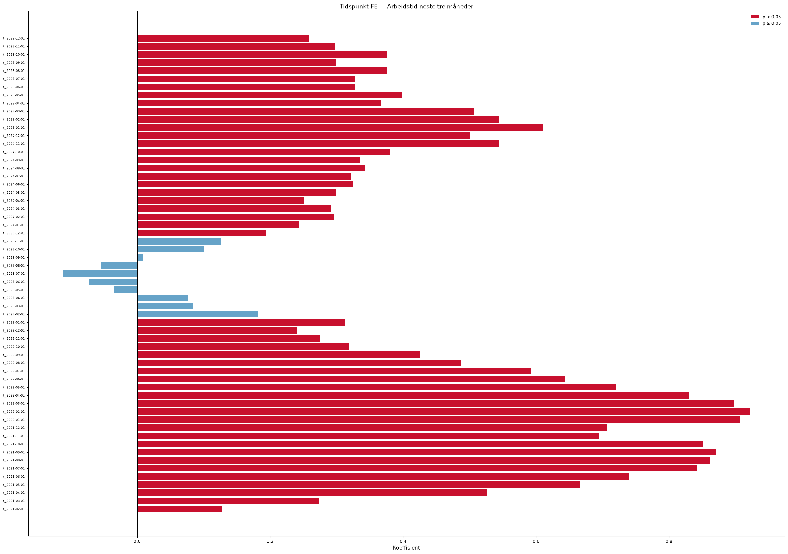{fig-align='center' width=90%}

### Eventstudie og parallell-trend-test

Eventsstudien samhandler periodevise indikatorer med en tidsinvariant intensitetsscore per region (maksimal tiltaksnedgang i post-perioden). Pre-periode-koeffisientene (τ < 0) bør ligge nær null dersom parallelle trender holder. Blå = basis, rød = sesongjustert modell.

**Advarsel:** pre-trend-testen er signifikant (F(11,11) = 107.95, p = 0.000), noe som svekker DiD-antakelsen.

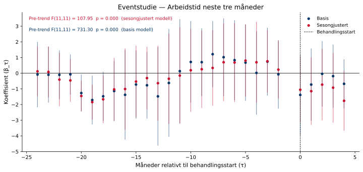{fig-align='center' width=95%}

### Placebotest (τ = −12)

Begge modeller re-estimeres med en falsk behandlingsstart tolv måneder tidligere, utelukkende i pre-perioden. Estimater nær null styrker antakelsen om at resultatene ikke skyldes pre-eksisterende trender.

Sesongjustert modell — placebo-koeffisienten er 1.2056 (p = 0.614). Dette er ikke signifikant, noe som styrker identifikasjonsstrategien.

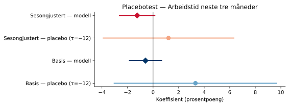{fig-align='center' width=80%}

### Leave-one-out robusthet

Begge modeller re-estimeres tolv ganger, én for hver region som droppes. Det skyggelagte feltet viser 95 %-konfidensintervallet for full-utvalgsmodellen.

Sesongjustert modell: koeffisienten varierer mellom -1.8309 til -0.8223 når én region utelates.

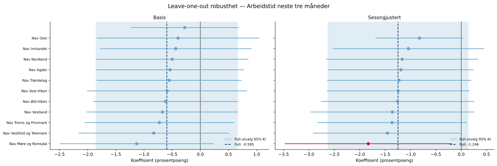{fig-align='center' width=95%}

## I jobb etter 3 måneder (`jobb3`)

### Deskriptiv statistikk

|                      |   Gjennomsnitt |   Std.avvik |      Min |      Maks |
|:---------------------|---------------:|------------:|---------:|----------:|
| jobb3                |         19.792 |       3.961 |    3.222 |    45.238 |
| Tiltaksnedgang (0–1) |          0.008 |       0.033 |    0     |     0.234 |
| Tiltak (antall)      |       5438.12  |    2065.21  | 2369.59  | 10816.6   |

**Behandlingsvariabel per region (gjennomsnitt i post-perioden):**

| Region                   |   Gj.snitt nedgang (0–1) |
|:-------------------------|-------------------------:|
| Nav Møre og Romsdal      |                    0.187 |
| Nav Oslo                 |                    0.125 |
| Nav Rogaland             |                    0.113 |
| Nav Vestland             |                    0.109 |
| Nav Øst-Viken            |                    0.091 |
| Nav Vest-Viken           |                    0.062 |
| Nav Agder                |                    0.058 |
| Nav Trøndelag            |                    0.044 |
| Nav Troms og Finnmark    |                    0.036 |
| Nav Nordland             |                    0.003 |
| Nav Innlandet            |                    0.001 |
| Nav Vestfold og Telemark |                    0     |

### Trender over tid

Regionene er delt i to grupper basert på median behandlingsintensitet (gjennomsnittlig tiltaksnedgang i post-perioden).

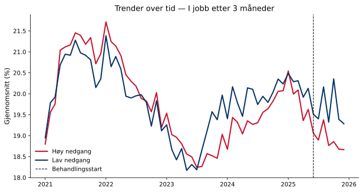{fig-align='center' width=90%}

### Regresjonsresultater

Koeffisienten for behandlingsvariabelen angir estimert effekt av å gå fra null til full tiltaksnedgang (behandlingsintensitet = 1) på indikatoren, i prosentpoeng. Et positivt fortegn betyr at regioner med større tiltaksnedgang hadde høyere indikatorverdier i post-perioden sammenlignet med kontrafaktum; et negativt fortegn betyr lavere verdier. Størrelsen angir den absolutte endringen i prosentpoeng ved full tiltaksnedgang. Signifikansstjerner og primær p-verdi basert på wild cluster bootstrap (Webb-vekter, G = 12, B = 4,999).

| Modell        |   Koeffisient |   Std.feil (CR1) |   t-stat |   p (bootstrap) |   p (asymptotisk) | 95% KI            |   Obs. |   Clustere |
|:--------------|--------------:|-----------------:|---------:|----------------:|------------------:|:------------------|-------:|-----------:|
| Basis         |       -1.3363 |           2.0152 |   -0.663 |           0.539 |            0.5209 | [-5.7718, 3.0992] |  12928 |         12 |
| Sesongjustert |       -3.3702 |           2.3758 |   -1.419 |           0.183 |            0.1837 | [-8.5992, 1.8588] |  12885 |         12 |

> **Signifikansnivå (bootstrap):** \* p < 0,10 &nbsp; \*\* p < 0,05 &nbsp; \*\*\* p < 0,01

**Gjennomsnittlig pre-periode-nivå:** 19.9 % — koeffisienten tilsvarer en relativ endring på -17.0 %.  
**Minimum detekterbar effekt (80 % styrke, α = 0,05):** ±7.31 pp.

### Bootstrap-fordeling

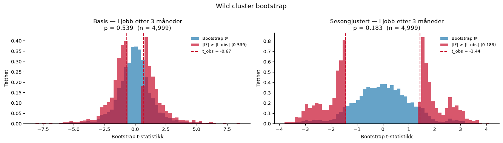{fig-align='center' width=95%}

### Faste effekter

Stolpediagrammene viser koeffisientene for de faste effektene i den sesongjusterte modellen. Røde søyler er signifikante på 5 %-nivå.

**Entitet FE**

{fig-align='center' width=90%}

**Tidspunkt FE**

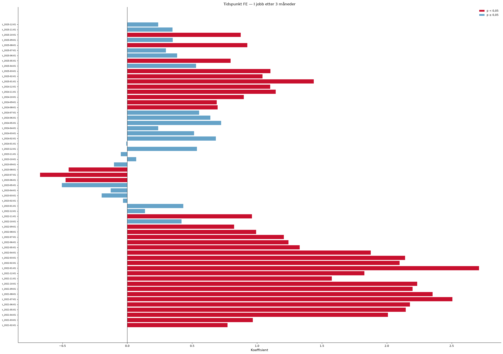{fig-align='center' width=90%}

### Eventstudie og parallell-trend-test

Eventsstudien samhandler periodevise indikatorer med en tidsinvariant intensitetsscore per region (maksimal tiltaksnedgang i post-perioden). Pre-periode-koeffisientene (τ < 0) bør ligge nær null dersom parallelle trender holder. Blå = basis, rød = sesongjustert modell.

**Advarsel:** pre-trend-testen er signifikant (F(11,11) = 28.30, p = 0.000), noe som svekker DiD-antakelsen.

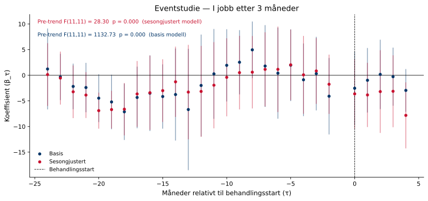{fig-align='center' width=95%}

### Placebotest (τ = −12)

Begge modeller re-estimeres med en falsk behandlingsstart tolv måneder tidligere, utelukkende i pre-perioden. Estimater nær null styrker antakelsen om at resultatene ikke skyldes pre-eksisterende trender.

Sesongjustert modell — placebo-koeffisienten er 1.4518 (p = 0.821). Dette er ikke signifikant, noe som styrker identifikasjonsstrategien.

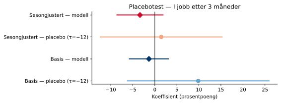{fig-align='center' width=80%}

### Leave-one-out robusthet

Begge modeller re-estimeres tolv ganger, én for hver region som droppes. Det skyggelagte feltet viser 95 %-konfidensintervallet for full-utvalgsmodellen.

Sesongjustert modell: koeffisienten varierer mellom -5.9679 til -2.2080 når én region utelates.

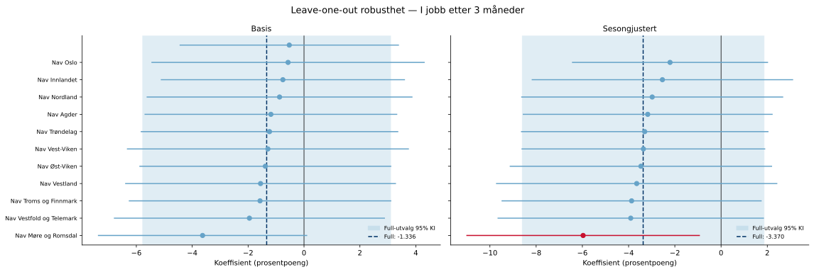{fig-align='center' width=95%}

---

*Rapporten er automatisk generert av analysepipelinen.*
