| Egenskap | Verdi |
|---|---|
| Behandlingstype | Kontinuerlig |
| Behandlingsstart | 2025-06 |
| Variasjon i behandling | Nav-regioner |
| Undergruppe (populasjon) | Alle |
| Utfallsmål (indikatortype) | — |
| Indikatorer | atid3 — Arbeidstid neste tre måneder, jobb3 — I jobb etter 3 måneder |

## Bakgrunn og metode

Denne rapporten analyserer om nedgangen i arbeidsmarkedstiltak fra og med 2025-06 har hatt målbar effekt på Nav-indikatorer for overgang til arbeid.

Analysen bruker en *difference-in-differences*-tilnærming med **kontinuerlig behandling**. Behandlingsvariabelen (`tiltaksnedgang`) måler hvor mye tiltaksnivået i en region har falt relativt til toppen i pre-perioden, og varierer kontinuerlig mellom 0 (ingen nedgang) og 1 (full nedgang). Modellen inkluderer region-faste effekter og tidspunkt-faste effekter for å kontrollere for tidsinvariante regionforskjeller og felles nasjonale trender.

To modellspesifikasjoner estimeres:

- **Basis:** Ujustert indikator, region FE + år-måned FE
- **Sesongjustert:** Sesongjustert indikator, region FE + år-måned FE

> **Signifikansnivå:** \* p < 0,10 &nbsp; \*\* p < 0,05 &nbsp; \*\*\* p < 0,01
> Standardfeil er clustret på regionnivå (CR1 småutvalgskorrigering).
> Med kun G = 12 regioner er asymptotisk clusterinferens upålitelig; primær p-verdi er basert på wild cluster bootstrap med Webb-vekter (B = 4 999).

## Tiltaksbruk over tid

Tiltaksbruk (midlertidig lønnstilskudd) per region over tid. Den stiplede linjen markerer behandlingsstart.

{fig-align='center' width=95%}

## Arbeidstid neste tre måneder (`atid3`)

### Deskriptiv statistikk

|                      |   Gjennomsnitt |   Std.avvik |     Min |    Maks |
|:---------------------|---------------:|------------:|--------:|--------:|
| atid3                |          0.017 |       0.303 |  -0.981 |    1.47 |
| Tiltaksnedgang (0–1) |          0.021 |       0.092 |   0     |    0.69 |
| Tiltak (antall)      |        593.907 |     224.287 | 134     | 1224    |

**Behandlingsvariabel per region (gjennomsnitt i post-perioden):**

| Region                   |   Gj.snitt nedgang (0–1) |
|:-------------------------|-------------------------:|
| Nav Vest-Viken           |                    0.425 |
| Nav Møre og Romsdal      |                    0.401 |
| Nav Troms og Finnmark    |                    0.391 |
| Nav Agder                |                    0.388 |
| Nav Vestland             |                    0.378 |
| Nav Rogaland             |                    0.341 |
| Nav Oslo                 |                    0.317 |
| Nav Trøndelag            |                    0.303 |
| Nav Øst-Viken            |                    0.282 |
| Nav Vestfold og Telemark |                    0.23  |
| Nav Nordland             |                    0.158 |
| Nav Innlandet            |                    0.1   |

### Trender over tid

Regionene er delt i to grupper basert på median behandlingsintensitet (gjennomsnittlig tiltaksnedgang i post-perioden).

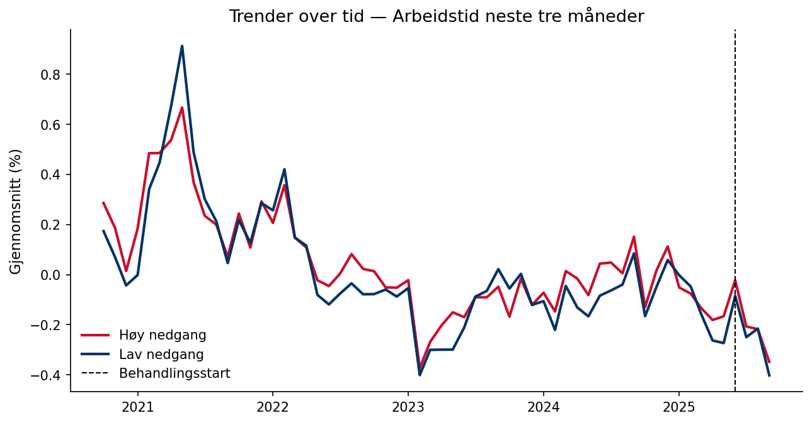{fig-align='center' width=90%}

### Regresjonsresultater

Koeffisienten for behandlingsvariabelen angir estimert effekt av å gå fra null til full tiltaksnedgang (behandlingsintensitet = 1) på indikatoren, i prosentpoeng. Et positivt fortegn betyr at regioner med større tiltaksnedgang hadde høyere indikatorverdier i post-perioden sammenlignet med kontrafaktum; et negativt fortegn betyr lavere verdier. Størrelsen angir den absolutte endringen i prosentpoeng ved full tiltaksnedgang. Signifikansstjerner og primær p-verdi basert på wild cluster bootstrap (Webb-vekter, G = 12, B = 4,999).

| Modell        |   Koeffisient |   Std.feil (CR1) |   t-stat |   p (bootstrap) |   p (asymptotisk) | 95% KI            |   Obs. |   Clustere |
|:--------------|--------------:|-----------------:|---------:|----------------:|------------------:|:------------------|-------:|-----------:|
| Basis         |        0.1684 |           0.1285 |    1.31  |           0.164 |            0.2167 | [-0.1144, 0.4511] |    720 |         12 |
| Sesongjustert |       -0.1542 |           0.0816 |   -1.889 |           0.197 |            0.0856 | [-0.3339, 0.0255] |    720 |         12 |

> **Signifikansnivå (bootstrap):** \* p < 0,10 &nbsp; \*\* p < 0,05 &nbsp; \*\*\* p < 0,01

**Gjennomsnittlig pre-periode-nivå:** 0.0 % — koeffisienten tilsvarer en relativ endring på -456.6 %.
**Minimum detekterbar effekt (80 % styrke, α = 0,05):** ±0.25 pp.

### Bootstrap-fordeling

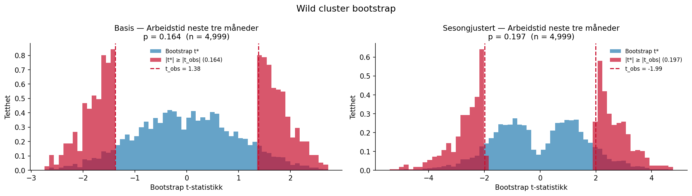{fig-align='center' width=95%}

### Faste effekter

Stolpediagrammene viser koeffisientene for de faste effektene i den sesongjusterte modellen. Røde søyler er signifikante på 5 %-nivå.

**Region FE**

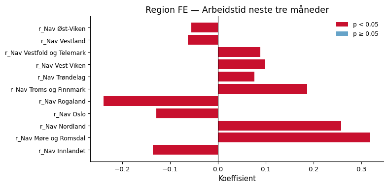{fig-align='center' width=90%}

**Tidspunkt FE**

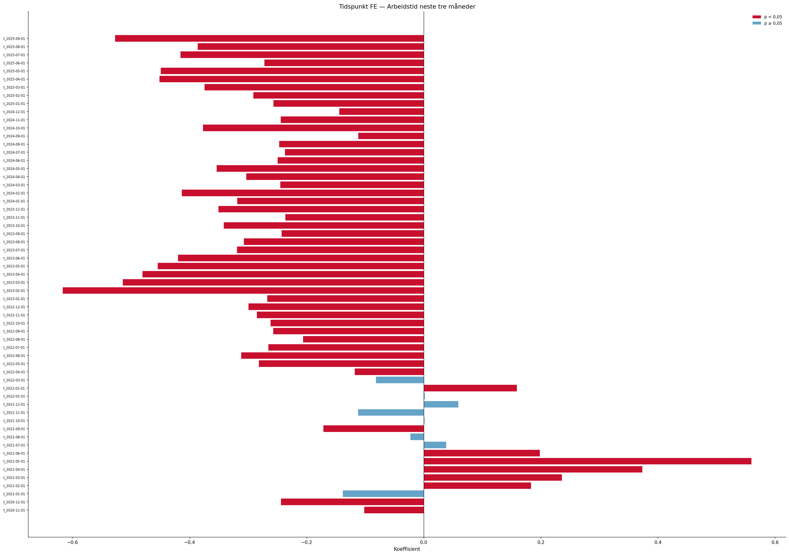{fig-align='center' width=90%}

### Eventstudie og parallell-trend-test

Eventsstudien samhandler periodevise indikatorer med en tidsinvariant intensitetsscore per region (maksimal tiltaksnedgang i post-perioden). Pre-periode-koeffisientene (τ < 0) bør ligge nær null dersom parallelle trender holder. Blå = basis, rød = sesongjustert modell.

Det er **ikke** statistisk grunnlag for å forkaste parallelle trender (F(10,11) = 1.31, p = 0.331, sesongjustert modell).

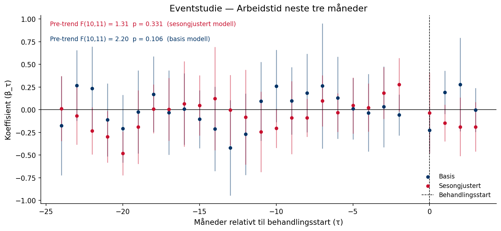{fig-align='center' width=95%}

### Placebotest (τ = −12)

Begge modeller re-estimeres med en falsk behandlingsstart tolv måneder tidligere, utelukkende i pre-perioden. Estimater nær null styrker antakelsen om at resultatene ikke skyldes pre-eksisterende trender.

Sesongjustert modell — placebo-koeffisienten er -0.0643 (p = 0.573). Dette er ikke signifikant, noe som styrker identifikasjonsstrategien.

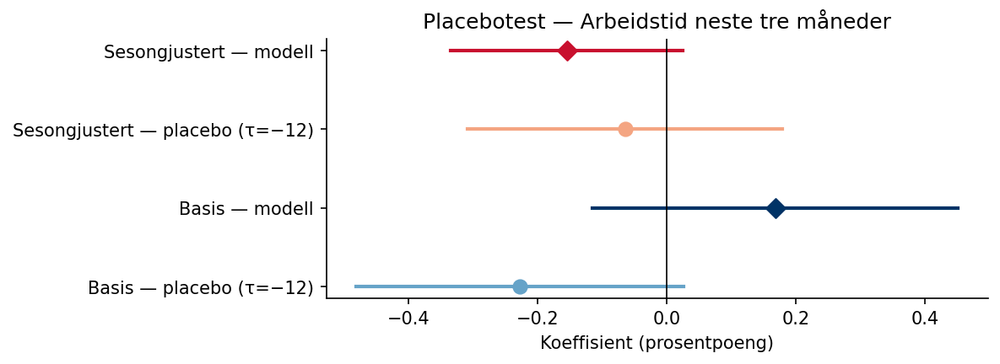{fig-align='center' width=80%}

### Leave-one-out robusthet

Begge modeller re-estimeres tolv ganger, én for hver region som droppes. Det skyggelagte feltet viser 95 %-konfidensintervallet for full-utvalgsmodellen.

Sesongjustert modell: koeffisienten varierer mellom -0.1813 til -0.0471 når én region utelates.

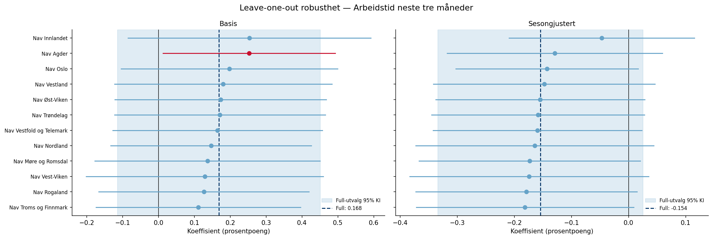{fig-align='center' width=95%}

## I jobb etter 3 måneder (`jobb3`)

### Deskriptiv statistikk

|                      |   Gjennomsnitt |   Std.avvik |     Min |     Maks |
|:---------------------|---------------:|------------:|--------:|---------:|
| jobb3                |          0.267 |       0.995 |  -3.271 |    4.149 |
| Tiltaksnedgang (0–1) |          0.021 |       0.092 |   0     |    0.69  |
| Tiltak (antall)      |        593.907 |     224.287 | 134     | 1224     |

**Behandlingsvariabel per region (gjennomsnitt i post-perioden):**

| Region                   |   Gj.snitt nedgang (0–1) |
|:-------------------------|-------------------------:|
| Nav Vest-Viken           |                    0.425 |
| Nav Møre og Romsdal      |                    0.401 |
| Nav Troms og Finnmark    |                    0.391 |
| Nav Agder                |                    0.388 |
| Nav Vestland             |                    0.378 |
| Nav Rogaland             |                    0.341 |
| Nav Oslo                 |                    0.317 |
| Nav Trøndelag            |                    0.303 |
| Nav Øst-Viken            |                    0.282 |
| Nav Vestfold og Telemark |                    0.23  |
| Nav Nordland             |                    0.158 |
| Nav Innlandet            |                    0.1   |

### Trender over tid

Regionene er delt i to grupper basert på median behandlingsintensitet (gjennomsnittlig tiltaksnedgang i post-perioden).

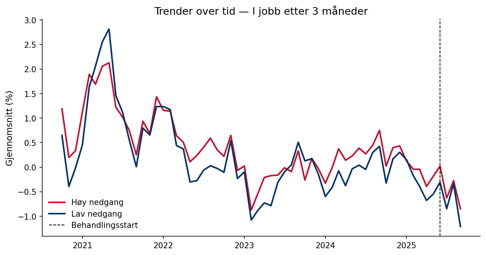{fig-align='center' width=90%}

### Regresjonsresultater

Koeffisienten for behandlingsvariabelen angir estimert effekt av å gå fra null til full tiltaksnedgang (behandlingsintensitet = 1) på indikatoren, i prosentpoeng. Et positivt fortegn betyr at regioner med større tiltaksnedgang hadde høyere indikatorverdier i post-perioden sammenlignet med kontrafaktum; et negativt fortegn betyr lavere verdier. Størrelsen angir den absolutte endringen i prosentpoeng ved full tiltaksnedgang. Signifikansstjerner og primær p-verdi basert på wild cluster bootstrap (Webb-vekter, G = 12, B = 4,999).

| Modell        |   Koeffisient |   Std.feil (CR1) |   t-stat |   p (bootstrap) |   p (asymptotisk) | 95% KI            |   Obs. |   Clustere |
|:--------------|--------------:|-----------------:|---------:|----------------:|------------------:|:------------------|-------:|-----------:|
| Basis         |        1.0422 |           0.6922 |    1.506 |           0.126 |            0.1603 | [-0.4814, 2.5658] |    720 |         12 |
| Sesongjustert |       -0.2135 |           0.521  |   -0.41  |           0.724 |            0.6898 | [-1.3601, 0.9331] |    720 |         12 |

> **Signifikansnivå (bootstrap):** \* p < 0,10 &nbsp; \*\* p < 0,05 &nbsp; \*\*\* p < 0,01

**Gjennomsnittlig pre-periode-nivå:** 0.3 % — koeffisienten tilsvarer en relativ endring på -65.6 %.
**Minimum detekterbar effekt (80 % styrke, α = 0,05):** ±1.60 pp.

### Bootstrap-fordeling

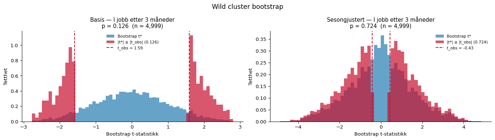{fig-align='center' width=95%}

### Faste effekter

Stolpediagrammene viser koeffisientene for de faste effektene i den sesongjusterte modellen. Røde søyler er signifikante på 5 %-nivå.

**Region FE**

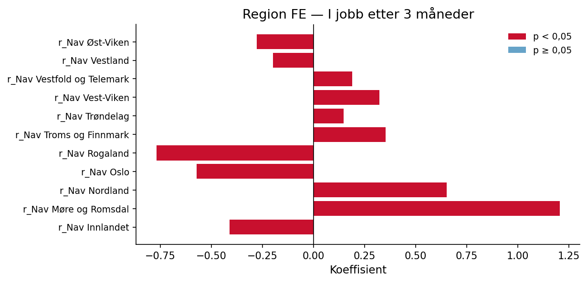{fig-align='center' width=90%}

**Tidspunkt FE**

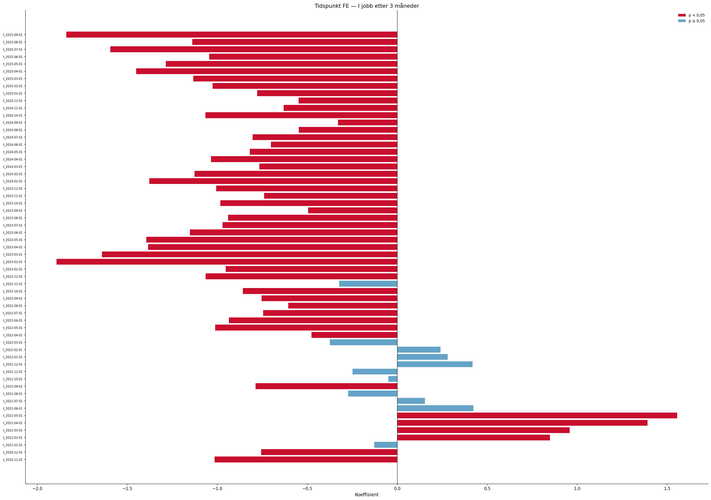{fig-align='center' width=90%}

### Eventstudie og parallell-trend-test

Eventsstudien samhandler periodevise indikatorer med en tidsinvariant intensitetsscore per region (maksimal tiltaksnedgang i post-perioden). Pre-periode-koeffisientene (τ < 0) bør ligge nær null dersom parallelle trender holder. Blå = basis, rød = sesongjustert modell.

**Advarsel:** pre-trend-testen er signifikant (F(10,11) = 4.77, p = 0.008), noe som svekker DiD-antakelsen.

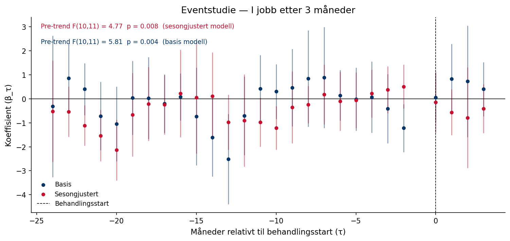{fig-align='center' width=95%}

### Placebotest (τ = −12)

Begge modeller re-estimeres med en falsk behandlingsstart tolv måneder tidligere, utelukkende i pre-perioden. Estimater nær null styrker antakelsen om at resultatene ikke skyldes pre-eksisterende trender.

Sesongjustert modell — placebo-koeffisienten er -0.3738 (p = 0.361). Dette er ikke signifikant, noe som styrker identifikasjonsstrategien.

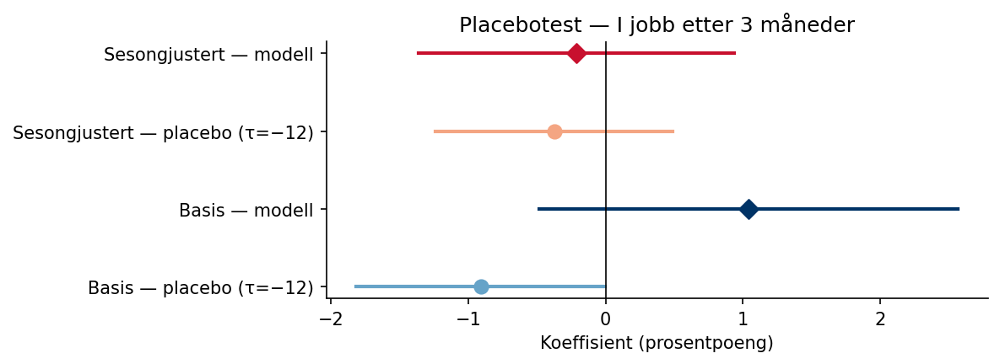{fig-align='center' width=80%}

### Leave-one-out robusthet

Begge modeller re-estimeres tolv ganger, én for hver region som droppes. Det skyggelagte feltet viser 95 %-konfidensintervallet for full-utvalgsmodellen.

Sesongjustert modell: koeffisienten varierer mellom -0.4932 til 0.3942 når én region utelates.

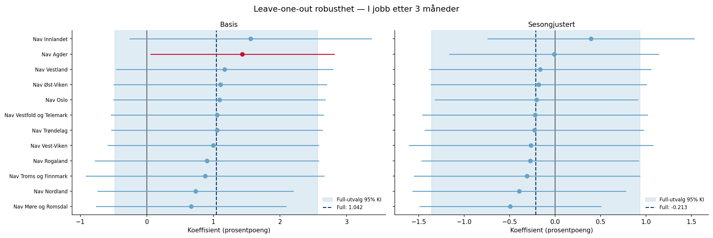{fig-align='center' width=95%}

---

*Rapporten er automatisk generert av analysepipelinen.*
