| Egenskap | Verdi |
|---|---|
| Behandlingstype | Diskret |
| Behandlingsstart | 2025-06 |
| Variasjon i behandling | Nav-regioner |
| Undergruppe (populasjon) | Innsatsgruppe_-_gode_muligheter |
| Utfallsmål (indikatortype) | — |
| Indikatorer | atid3 — Arbeidstid neste tre måneder, jobb3 — I jobb etter 3 måneder |
| Kontrollregioner | Nav Innlandet, Nav Nordland |

## Bakgrunn og metode

Denne rapporten analyserer om nedgangen i arbeidsmarkedstiltak fra og med 2025-06 har hatt målbar effekt på Nav-indikatorer for overgang til arbeid.

Analysen bruker en *difference-in-differences*-tilnærming med **diskret behandling**. Behandlingsvariabelen er binær: 1 for behandlede regioner i post-perioden, 0 ellers. Kontrollregioner: Nav Innlandet, Nav Nordland. Alle øvrige regioner klassifiseres som behandlede. Modellen inkluderer region-faste effekter og tidspunkt-faste effekter for å kontrollere for tidsinvariante regionforskjeller og felles nasjonale trender.

To modellspesifikasjoner estimeres:

- **Basis:** Ujustert indikator, region FE + år-måned FE
- **Sesongjustert:** Sesongjustert indikator, region FE + år-måned FE

> **Signifikansnivå:** \* p < 0,10 &nbsp; \*\* p < 0,05 &nbsp; \*\*\* p < 0,01  
> Standardfeil er clustret på regionnivå (CR1 småutvalgskorrigering).  
> Med kun G = 12 regioner er asymptotisk clusterinferens upålitelig; primær p-verdi er basert på wild cluster bootstrap med Webb-vekter (B = 4 999).

## Tiltaksbruk over tid

Tiltaksbruk (midlertidig lønnstilskudd) per region over tid. Den stiplede linjen markerer behandlingsstart.

{fig-align='center' width=95%}

## Arbeidstid neste tre måneder (`atid3`)

### Deskriptiv statistikk

|                 |   Gjennomsnitt |   Std.avvik |     Min |     Maks |
|:----------------|---------------:|------------:|--------:|---------:|
| atid3           |          0.916 |       0.767 |  -2.658 |    4.226 |
| Behandlet (0/1) |          0.056 |       0.229 |   0     |    1     |
| Tiltak (antall) |        593.907 |     224.287 | 134     | 1224     |

**Behandlingsvariabel per region (gjennomsnitt i post-perioden):**

| Region                   |   Behandlet (0=kontroll, 1=behandlet) |
|:-------------------------|--------------------------------------:|
| Nav Agder                |                                     1 |
| Nav Møre og Romsdal      |                                     1 |
| Nav Oslo                 |                                     1 |
| Nav Rogaland             |                                     1 |
| Nav Troms og Finnmark    |                                     1 |
| Nav Trøndelag            |                                     1 |
| Nav Vest-Viken           |                                     1 |
| Nav Vestfold og Telemark |                                     1 |
| Nav Vestland             |                                     1 |
| Nav Øst-Viken            |                                     1 |
| Nav Innlandet            |                                     0 |
| Nav Nordland             |                                     0 |

### Trender over tid

Regionene er delt inn i behandlet og kontrollgruppe.

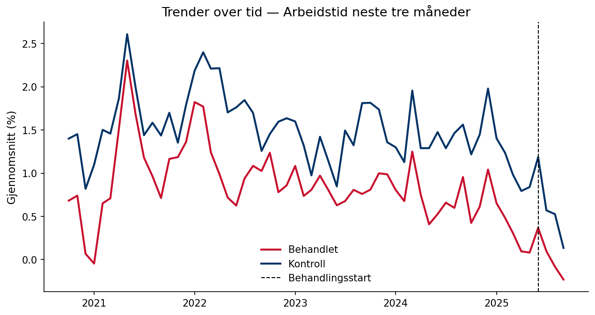{fig-align='center' width=90%}

### Regresjonsresultater

Koeffisienten for behandlingsvariabelen angir estimert gjennomsnittlig behandlingseffekt (ATT) på indikatoren, i prosentpoeng. Et positivt fortegn betyr at behandlede regioner hadde en høyere verdi på indikatoren i post-perioden sammenlignet med kontrafaktum; et negativt fortegn betyr lavere verdi. Størrelsen angir den absolutte endringen i prosentpoeng. Signifikansstjerner og primær p-verdi basert på wild cluster bootstrap (Webb-vekter, G = 12, B = 4,999).

| Modell        |   Koeffisient |   Std.feil (CR1) |   t-stat |   p (bootstrap) |   p (asymptotisk) | 95% KI            |   Obs. |   Clustere |
|:--------------|--------------:|-----------------:|---------:|----------------:|------------------:|:------------------|-------:|-----------:|
| Basis         |        0.2439 |           0.1109 |     2.2  |           0.156 |            0.0501 | [-0.0001, 0.4879] |    720 |         12 |
| Sesongjustert |        0.0871 |           0.1776 |     0.49 |           0.66  |            0.6335 | [-0.3039, 0.4781] |    720 |         12 |

> **Signifikansnivå (bootstrap):** \* p < 0,10 &nbsp; \*\* p < 0,05 &nbsp; \*\*\* p < 0,01

**Gjennomsnittlig pre-periode-nivå:** 1.0 % — koeffisienten tilsvarer en relativ endring på 9.0 %.  
**Minimum detekterbar effekt (80 % styrke, α = 0,05):** ±0.55 pp.

### Bootstrap-fordeling

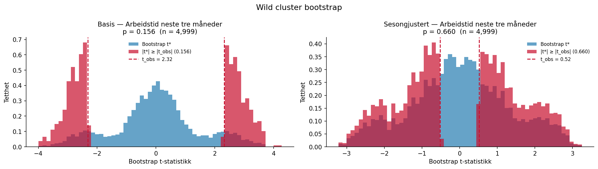{fig-align='center' width=95%}

### Faste effekter

Stolpediagrammene viser koeffisientene for de faste effektene i den sesongjusterte modellen. Røde søyler er signifikante på 5 %-nivå.

**Region FE**

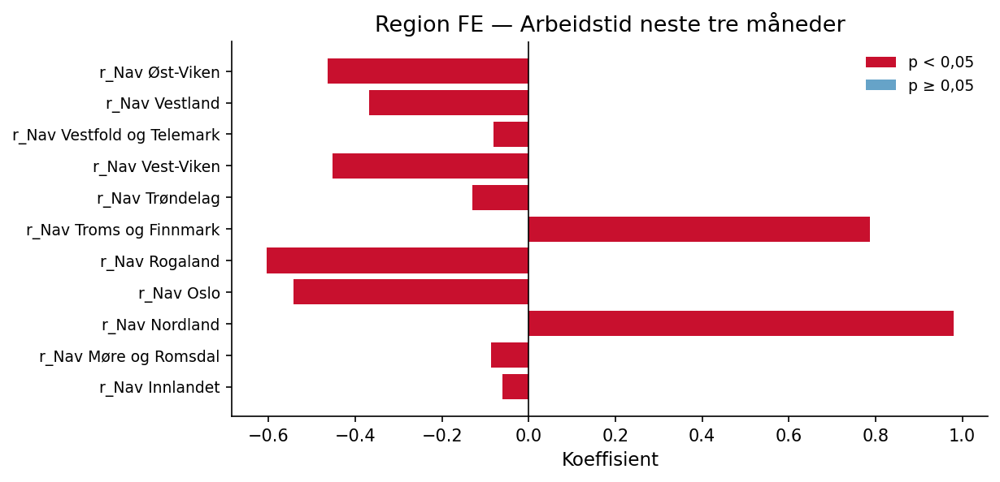{fig-align='center' width=90%}

**Tidspunkt FE**

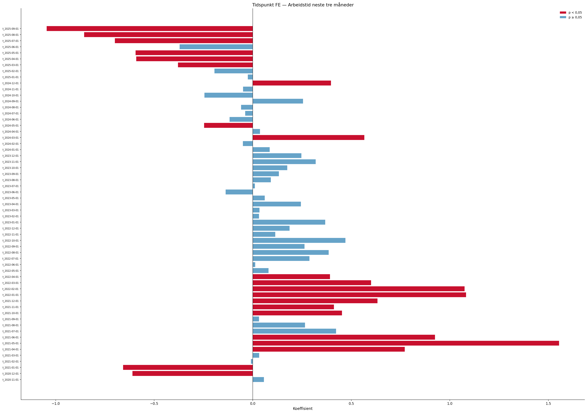{fig-align='center' width=90%}

### Eventstudie og parallell-trend-test

Eventsstudien samhandler periodevise indikatorer med en tidsinvariant behandlingindikator per region (0 = kontroll, 1 = behandlet). Pre-periode-koeffisientene (τ < 0) bør ligge nær null dersom parallelle trender holder. Blå = basis, rød = sesongjustert modell.

Det er **ikke** statistisk grunnlag for å forkaste parallelle trender (F(10,11) = 1.62, p = 0.220, sesongjustert modell).

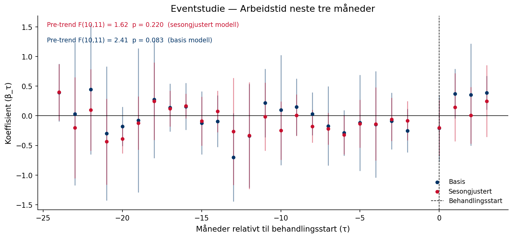{fig-align='center' width=95%}

### Placebotest (τ = −12)

Begge modeller re-estimeres med en falsk behandlingsstart tolv måneder tidligere, utelukkende i pre-perioden. Estimater nær null styrker antakelsen om at resultatene ikke skyldes pre-eksisterende trender.

Sesongjustert modell — placebo-koeffisienten er 0.8322 (p = 0.048). **Advarsel:** placebo-estimatet er signifikant, noe som kan indikere pre-eksisterende trender.

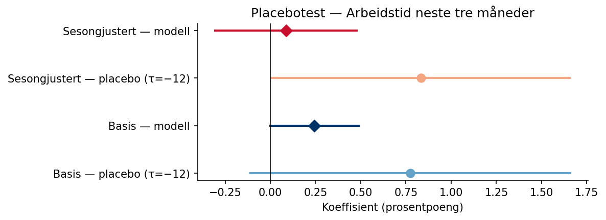{fig-align='center' width=80%}

### Leave-one-out robusthet

Begge modeller re-estimeres tolv ganger, én for hver region som droppes. Det skyggelagte feltet viser 95 %-konfidensintervallet for full-utvalgsmodellen.

Sesongjustert modell: koeffisienten varierer mellom -0.0972 til 0.2714 når én region utelates.

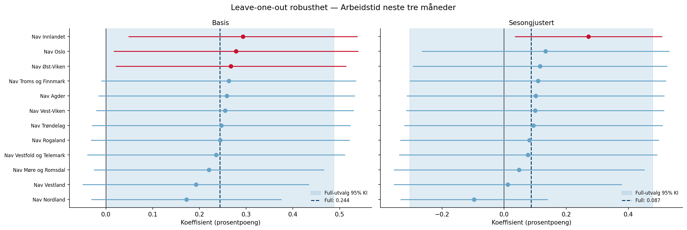{fig-align='center' width=95%}

## I jobb etter 3 måneder (`jobb3`)

### Deskriptiv statistikk

|                 |   Gjennomsnitt |   Std.avvik |     Min |     Maks |
|:----------------|---------------:|------------:|--------:|---------:|
| jobb3           |          2.725 |       2.467 |  -8.453 |   11.407 |
| Behandlet (0/1) |          0.056 |       0.229 |   0     |    1     |
| Tiltak (antall) |        593.907 |     224.287 | 134     | 1224     |

**Behandlingsvariabel per region (gjennomsnitt i post-perioden):**

| Region                   |   Behandlet (0=kontroll, 1=behandlet) |
|:-------------------------|--------------------------------------:|
| Nav Agder                |                                     1 |
| Nav Møre og Romsdal      |                                     1 |
| Nav Oslo                 |                                     1 |
| Nav Rogaland             |                                     1 |
| Nav Troms og Finnmark    |                                     1 |
| Nav Trøndelag            |                                     1 |
| Nav Vest-Viken           |                                     1 |
| Nav Vestfold og Telemark |                                     1 |
| Nav Vestland             |                                     1 |
| Nav Øst-Viken            |                                     1 |
| Nav Innlandet            |                                     0 |
| Nav Nordland             |                                     0 |

### Trender over tid

Regionene er delt inn i behandlet og kontrollgruppe.

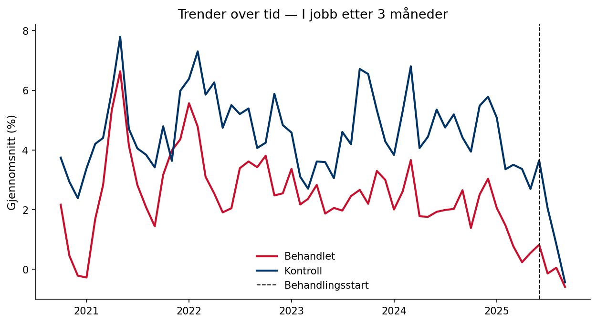{fig-align='center' width=90%}

### Regresjonsresultater

Koeffisienten for behandlingsvariabelen angir estimert gjennomsnittlig behandlingseffekt (ATT) på indikatoren, i prosentpoeng. Et positivt fortegn betyr at behandlede regioner hadde en høyere verdi på indikatoren i post-perioden sammenlignet med kontrafaktum; et negativt fortegn betyr lavere verdi. Størrelsen angir den absolutte endringen i prosentpoeng. Signifikansstjerner og primær p-verdi basert på wild cluster bootstrap (Webb-vekter, G = 12, B = 4,999).

| Modell        | Koeffisient   |   Std.feil (CR1) |   t-stat |   p (bootstrap) |   p (asymptotisk) | 95% KI            |   Obs. |   Clustere |
|:--------------|:--------------|-----------------:|---------:|----------------:|------------------:|:------------------|-------:|-----------:|
| Basis         | 1.5368*       |           0.3902 |    3.938 |           0.075 |            0.0023 | [0.6779, 2.3957]  |    720 |         12 |
| Sesongjustert | 0.6187        |           0.7873 |    0.786 |           0.634 |            0.4485 | [-1.1140, 2.3515] |    720 |         12 |

> **Signifikansnivå (bootstrap):** \* p < 0,10 &nbsp; \*\* p < 0,05 &nbsp; \*\*\* p < 0,01

**Gjennomsnittlig pre-periode-nivå:** 2.9 % — koeffisienten tilsvarer en relativ endring på 21.3 %.  
**Minimum detekterbar effekt (80 % styrke, α = 0,05):** ±2.42 pp.

### Bootstrap-fordeling

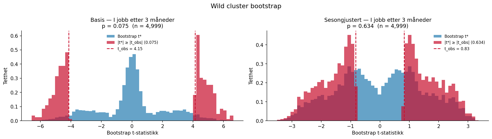{fig-align='center' width=95%}

### Faste effekter

Stolpediagrammene viser koeffisientene for de faste effektene i den sesongjusterte modellen. Røde søyler er signifikante på 5 %-nivå.

**Region FE**

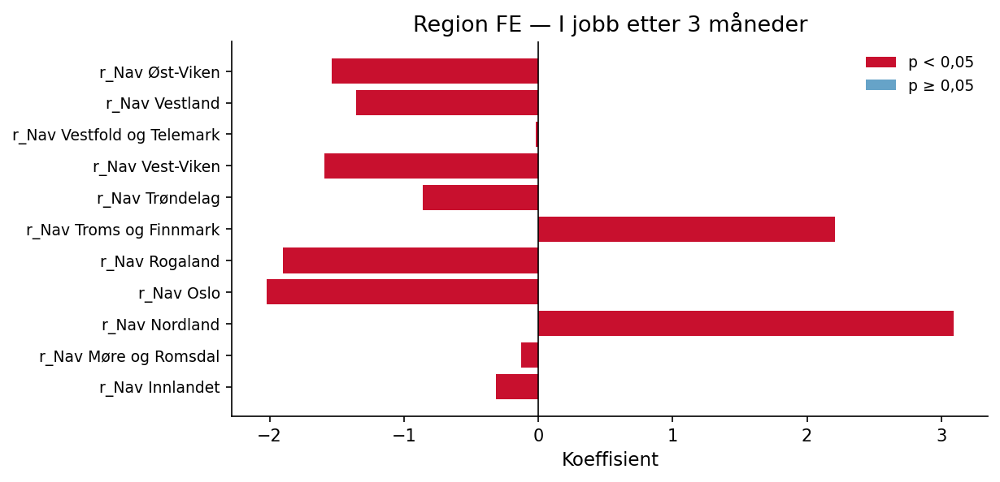{fig-align='center' width=90%}

**Tidspunkt FE**

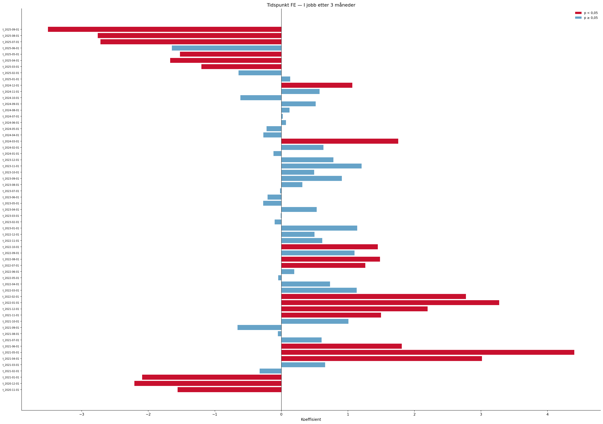{fig-align='center' width=90%}

### Eventstudie og parallell-trend-test

Eventsstudien samhandler periodevise indikatorer med en tidsinvariant behandlingindikator per region (0 = kontroll, 1 = behandlet). Pre-periode-koeffisientene (τ < 0) bør ligge nær null dersom parallelle trender holder. Blå = basis, rød = sesongjustert modell.

**Advarsel:** pre-trend-testen er signifikant (F(10,11) = 3.87, p = 0.018), noe som svekker DiD-antakelsen.

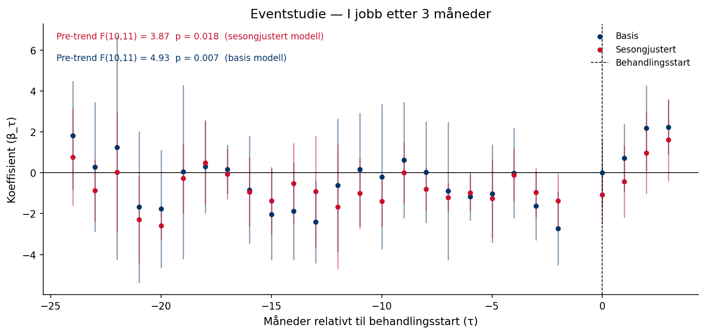{fig-align='center' width=95%}

### Placebotest (τ = −12)

Begge modeller re-estimeres med en falsk behandlingsstart tolv måneder tidligere, utelukkende i pre-perioden. Estimater nær null styrker antakelsen om at resultatene ikke skyldes pre-eksisterende trender.

Sesongjustert modell — placebo-koeffisienten er 4.3299 (p = 0.008). **Advarsel:** placebo-estimatet er signifikant, noe som kan indikere pre-eksisterende trender.

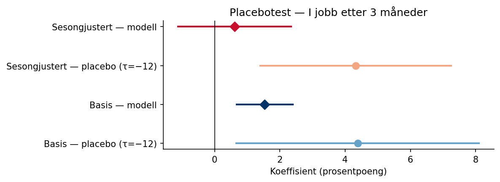{fig-align='center' width=80%}

### Leave-one-out robusthet

Begge modeller re-estimeres tolv ganger, én for hver region som droppes. Det skyggelagte feltet viser 95 %-konfidensintervallet for full-utvalgsmodellen.

Sesongjustert modell: koeffisienten varierer mellom -0.3000 til 1.5375 når én region utelates.

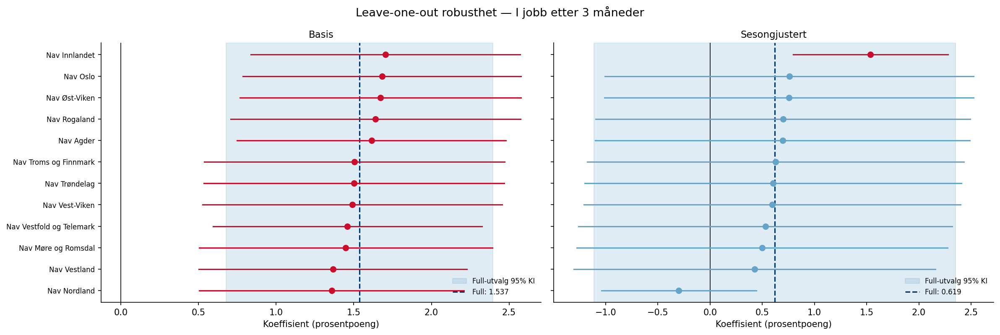{fig-align='center' width=95%}

---

*Rapporten er automatisk generert av analysepipelinen.*
