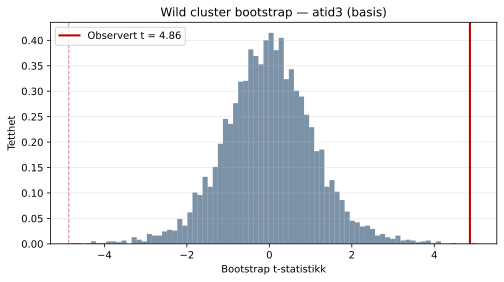
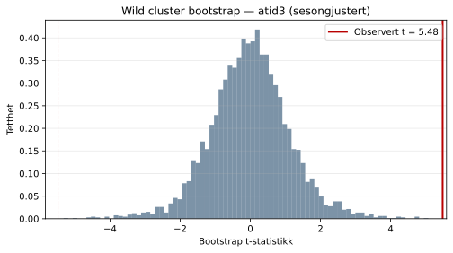
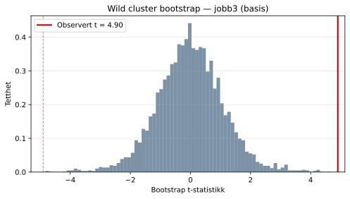
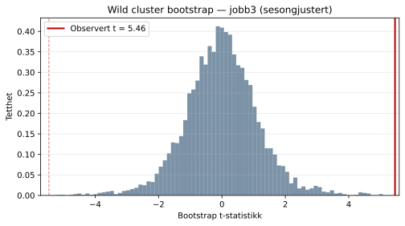

## Wild cluster bootstrap

Med et lavt antall regioner (clustere) er asymptotisk clusterinferens upålitelig.
Primær p-verdi er derfor basert på **wild cluster bootstrap** med Webb 6-punkt-vekter
(B = 4 999 replikasjoner). Fordelingen av bootstrap-t-statistikken vises nedenfor
for å gi et intuitivt bilde av usikkerheten.

Den røde vertikale linjen markerer den observerte t-statistikken. En smal fordeling
konsentrert rundt null med den observerte t-verdien langt ute i halen indikerer et
statistisk sjeldent resultat; en observert t-verdi tett på fordelingens sentrum
tilsvarer et ikke-signifikant funn.

### atid3 — basis

Observert koeffisient: **2.5402**  
Observert SE: **0.5223**  
Observert t-statistikk: **4.864**  
Bootstrap p-verdi: **0.0002**  
Antall replikasjoner: **4999**

Resultatet er **statistisk signifikant (***)** på bootstrap-grunnlag.

### atid3 — sesongjustert

Observert koeffisient: **3.0138**  
Observert SE: **0.5497**  
Observert t-statistikk: **5.483**  
Bootstrap p-verdi: **0.0000**  
Antall replikasjoner: **4999**

Resultatet er **statistisk signifikant (***)** på bootstrap-grunnlag.

### jobb3 — basis

Observert koeffisient: **8.4210**  
Observert SE: **1.7174**  
Observert t-statistikk: **4.903**  
Bootstrap p-verdi: **0.0000**  
Antall replikasjoner: **4999**

Resultatet er **statistisk signifikant (***)** på bootstrap-grunnlag.

### jobb3 — sesongjustert

Observert koeffisient: **9.3476**  
Observert SE: **1.7121**  
Observert t-statistikk: **5.460**  
Bootstrap p-verdi: **0.0000**  
Antall replikasjoner: **4999**

Resultatet er **statistisk signifikant (***)** på bootstrap-grunnlag.

