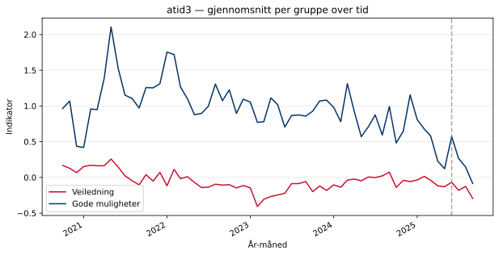
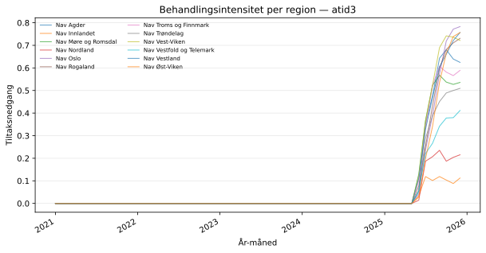
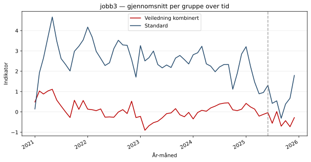
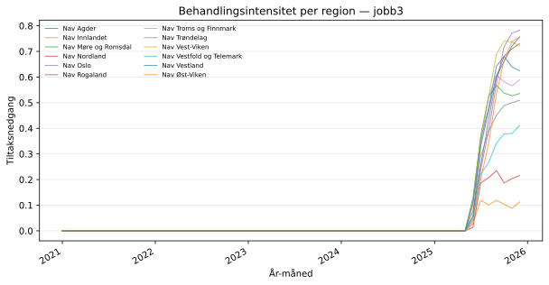

## Oversikt

Behandlet gruppe: **Veiledning kombinert**  
Kontrollgruppe: **Standard**  
Analysenivå: **enhet**

Dette kapittelet gir en oversikt over datamaterialet og viser trender for de
to gruppene over tid. Et viktig visuelt kriterium for trippel-diff-strategien
er at **Veiledning kombinert** og **Standard** fulgte parallelle trender i
pre-perioden — avvik her vil svekke identifikasjonen.

## atid3

### Dataoversikt

- Antall observasjoner: **27670**
- Antall regioner: **12**
- Antall enheter: **242**
- Antall måneder: **60**
- Behandlet gruppe (Veiledning kombinert, n): **13820**
- Kontrollgruppe (Standard, n): **13850**

**Gjennomsnittlig indikatorverdi i pre-perioden:**

| Gruppe | Gjennomsnitt |
|:--|--:|
| Veiledning kombinert (behandlet) | -0.0717 |
| Standard (kontroll) | 0.8697 |
| Differanse | -0.9414 |

I pre-perioden lå Veiledning kombinert i gjennomsnitt **0.9414** poeng
lavere enn Standard på indikatoren `atid3`.
Denne nivåforskjellen absorberes av gruppe-faste effekter i regresjonen.

### Trender over tid — atid3

Figuren viser gjennomsnittlig indikatorverdi per måned for de to gruppene.
Den stiplede linjen markerer behandlingsstart. Parallelle trender i
pre-perioden er en forutsetning for identifikasjonen.

### Behandlingsintensitet per region — atid3

Figuren viser tiltaksnedgangen per region over tid. Regionene skiller seg
fra hverandre i intensitet, noe som er kilden til identifikasjonen i den
kontinuerlige trippel-diff-modellen.

## jobb3

### Dataoversikt

- Antall observasjoner: **27670**
- Antall regioner: **12**
- Antall enheter: **242**
- Antall måneder: **60**
- Behandlet gruppe (Veiledning kombinert, n): **13820**
- Kontrollgruppe (Standard, n): **13850**

**Gjennomsnittlig indikatorverdi i pre-perioden:**

| Gruppe | Gjennomsnitt |
|:--|--:|
| Veiledning kombinert (behandlet) | 0.1061 |
| Standard (kontroll) | 2.6029 |
| Differanse | -2.4969 |

I pre-perioden lå Veiledning kombinert i gjennomsnitt **2.4969** poeng
lavere enn Standard på indikatoren `jobb3`.
Denne nivåforskjellen absorberes av gruppe-faste effekter i regresjonen.

### Trender over tid — jobb3

Figuren viser gjennomsnittlig indikatorverdi per måned for de to gruppene.
Den stiplede linjen markerer behandlingsstart. Parallelle trender i
pre-perioden er en forutsetning for identifikasjonen.

### Behandlingsintensitet per region — jobb3

Figuren viser tiltaksnedgangen per region over tid. Regionene skiller seg
fra hverandre i intensitet, noe som er kilden til identifikasjonen i den
kontinuerlige trippel-diff-modellen.

