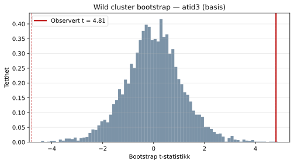
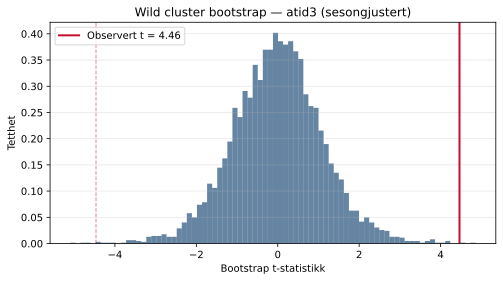
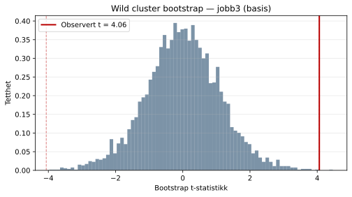
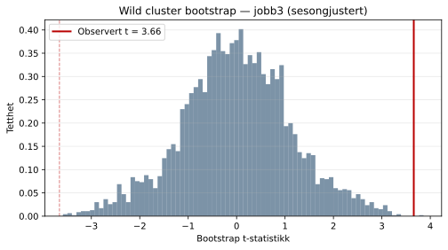

## Wild cluster bootstrap

Med et lavt antall regioner (clustere) er asymptotisk clusterinferens upålitelig.
Primær p-verdi er derfor basert på **wild cluster bootstrap** med Webb 6-punkt-vekter
(B = 4 999 replikasjoner). Fordelingen av bootstrap-t-statistikken vises nedenfor
for å gi et intuitivt bilde av usikkerheten.

Den røde vertikale linjen markerer den observerte t-statistikken. En smal fordeling
konsentrert rundt null med den observerte t-verdien langt ute i halen indikerer et
statistisk sjeldent resultat; en observert t-verdi tett på fordelingens sentrum
tilsvarer et ikke-signifikant funn.

### atid3 — basis

Observert koeffisient: **1.2849**
Observert SE: **0.3597**
Observert t-statistikk: **3.573**
Bootstrap p-verdi: **0.0058**
Antall replikasjoner: **4999**

Resultatet er **statistisk signifikant (***)** på bootstrap-grunnlag.

### atid3 — sesongjustert

Observert koeffisient: **1.6781**
Observert SE: **0.3759**
Observert t-statistikk: **4.465**
Bootstrap p-verdi: **0.0010**
Antall replikasjoner: **4999**

Resultatet er **statistisk signifikant (***)** på bootstrap-grunnlag.

### jobb3 — basis

Observert koeffisient: **3.5630**
Observert SE: **1.2111**
Observert t-statistikk: **2.942**
Bootstrap p-verdi: **0.0044**
Antall replikasjoner: **4999**

Resultatet er **statistisk signifikant (***)** på bootstrap-grunnlag.

### jobb3 — sesongjustert

Observert koeffisient: **4.6107**
Observert SE: **1.2859**
Observert t-statistikk: **3.586**
Bootstrap p-verdi: **0.0012**
Antall replikasjoner: **4999**

Resultatet er **statistisk signifikant (***)** på bootstrap-grunnlag.

