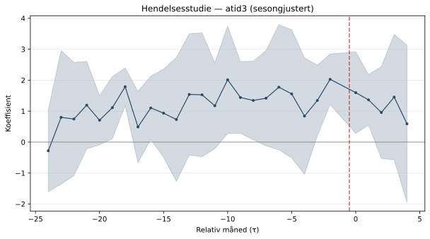
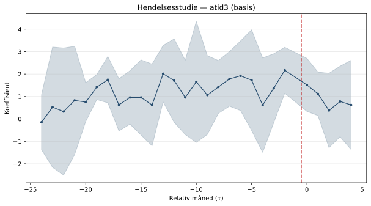
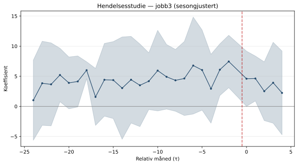
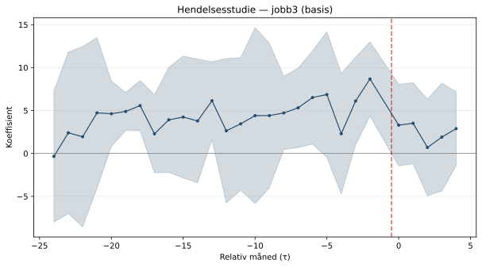
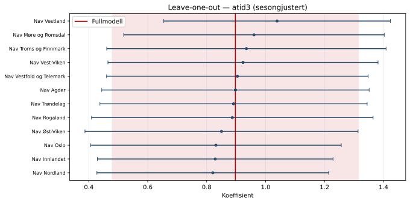
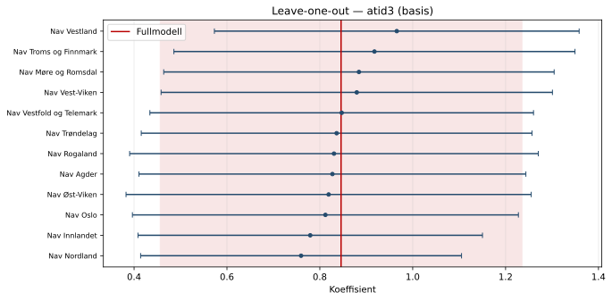
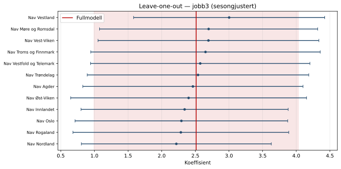
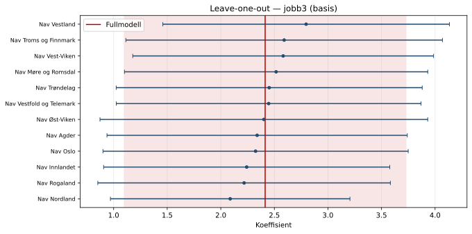

## Hendelsesstudie

Trippel-diff-hendelsesstudien interagerer regionens behandlingsintensitet
med gruppeindikator (Veiledning kombinert vs. Standard) og tidsperiode.
Koeffisientene for τ < 0 (pre-perioden) bør ligge nær null dersom
parallell-trendantagelsen holder — det vil si at tiltaksnedgangen ikke
predikerer divergerende trender mellom Veiledning kombinert og Standard *før*
behandlingsstart.

### atid3 — sesongjustert

**Det er statistisk grunnlag for å forkaste parallelle trender** (F(11,11) = 468.166, p = 0.0000). Dette er et advarselssignal for identifikasjonsstrategien.

### atid3 — basis

**Det er statistisk grunnlag for å forkaste parallelle trender** (F(11,11) = 129.070, p = 0.0000). Dette er et advarselssignal for identifikasjonsstrategien.

### jobb3 — sesongjustert

**Det er statistisk grunnlag for å forkaste parallelle trender** (F(11,11) = 113.266, p = 0.0000). Dette er et advarselssignal for identifikasjonsstrategien.

### jobb3 — basis

**Det er statistisk grunnlag for å forkaste parallelle trender** (F(11,11) = 326.948, p = 0.0000). Dette er et advarselssignal for identifikasjonsstrategien.

## Placebotest

Placebo-analysen re-estimerer trippel-diff-modellen med en *falsk*
behandlingsdato 12 måneder før den virkelige, utelukkende i pre-perioden.
Et estimat nær null og et ikke-signifikant resultat tyder på at parallell-
trendantagelsen holder og at det ikke er pre-eksisterende divergerende
trender mellom Veiledning kombinert og Standard.

### atid3 — sesongjustert

Placebo-koeffisienten er **-3.0493** (SE = 0.8396, p = 0.0039).
Dette er **statistisk signifikant (***) — dette er et advarselssignal**.

### atid3 — basis

Placebo-koeffisienten er **-3.6040** (SE = 0.7836, p = 0.0008).
Dette er **statistisk signifikant (***) — dette er et advarselssignal**.

### jobb3 — sesongjustert

Placebo-koeffisienten er **-13.1400** (SE = 2.1955, p = 0.0001).
Dette er **statistisk signifikant (***) — dette er et advarselssignal**.

### jobb3 — basis

Placebo-koeffisienten er **-15.7165** (SE = 1.8765, p = 0.0000).
Dette er **statistisk signifikant (***) — dette er et advarselssignal**.

## Leave-one-out robusthet

Modellen re-estimeres med én region utelatt om gangen.
Stabile koeffisienter på tvers av utelatelsene tilsier at ingen enkeltregion
er avgjørende for resultatet. Dersom en utelatelse endrer koeffisienten
vesentlig eller flytter den over signifikansterskelen, bør den regionen
undersøkes nærmere.

### atid3 — sesongjustert

Fullmodell-koeffisienten er **0.8974**.
Koeffisienten varierer mellom **0.8209** og **1.0390** når én region utelates. Fortegnet er stabilt på tvers av alle utelatelser.

### atid3 — basis

Fullmodell-koeffisienten er **0.8457**.
Koeffisienten varierer mellom **0.7596** og **0.9657** når én region utelates. Fortegnet er stabilt på tvers av alle utelatelser.

### jobb3 — sesongjustert

Fullmodell-koeffisienten er **2.5128**.
Koeffisienten varierer mellom **2.2177** og **3.0025** når én region utelates. Fortegnet er stabilt på tvers av alle utelatelser.

### jobb3 — basis

Fullmodell-koeffisienten er **2.4140**.
Koeffisienten varierer mellom **2.0878** og **2.7964** når én region utelates. Fortegnet er stabilt på tvers av alle utelatelser.

