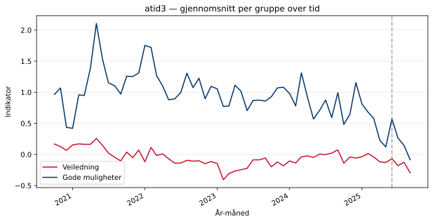
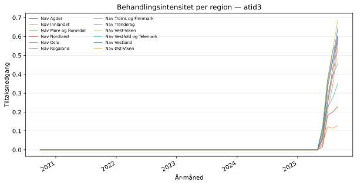
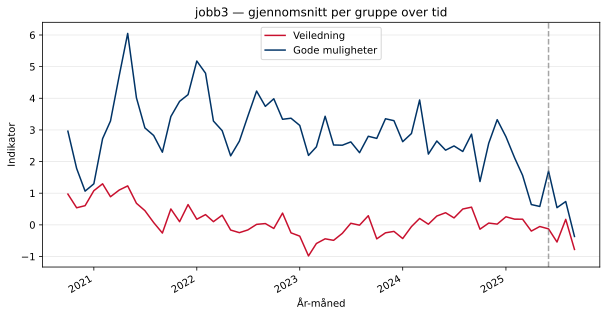
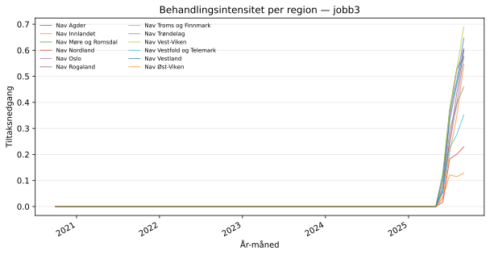

## Oversikt

Behandlet gruppe: **trenger-veiledning**  
Kontrollgruppe: **gode-muligheter**  
Analysenivå: **enhet**

Dette kapittelet gir en oversikt over datamaterialet og viser trender for de
to gruppene over tid. Et viktig visuelt kriterium for trippel-diff-strategien
er at **trenger-veiledning** og **gode-muligheter** fulgte parallelle trender i
pre-perioden — avvik her vil svekke identifikasjonen.

## atid3

### Dataoversikt

- Antall observasjoner: **27940**
- Antall regioner: **12**
- Antall enheter: **245**
- Antall måneder: **60**
- Behandlet gruppe (trenger-veiledning, n): **13915**
- Kontrollgruppe (gode-muligheter, n): **14025**

**Gjennomsnittlig indikatorverdi i pre-perioden:**

| Gruppe | Gjennomsnitt |
|:--|--:|
| trenger-veiledning (behandlet) | -0.0450 |
| gode-muligheter (kontroll) | 0.9914 |
| Differanse | -1.0364 |

I pre-perioden lå trenger-veiledning i gjennomsnitt **1.0364** poeng
lavere enn gode-muligheter på indikatoren `atid3`.
Denne nivåforskjellen absorberes av gruppe-faste effekter i regresjonen.

### Trender over tid — atid3

Figuren viser gjennomsnittlig indikatorverdi per måned for de to gruppene.
Den stiplede linjen markerer behandlingsstart. Parallelle trender i
pre-perioden er en forutsetning for identifikasjonen.

### Behandlingsintensitet per region — atid3

Figuren viser tiltaksnedgangen per region over tid. Regionene skiller seg
fra hverandre i intensitet, noe som er kilden til identifikasjonen i den
kontinuerlige trippel-diff-modellen.

## jobb3

### Dataoversikt

- Antall observasjoner: **27940**
- Antall regioner: **12**
- Antall enheter: **245**
- Antall måneder: **60**
- Behandlet gruppe (trenger-veiledning, n): **13915**
- Kontrollgruppe (gode-muligheter, n): **14025**

**Gjennomsnittlig indikatorverdi i pre-perioden:**

| Gruppe | Gjennomsnitt |
|:--|--:|
| trenger-veiledning (behandlet) | 0.1637 |
| gode-muligheter (kontroll) | 2.9518 |
| Differanse | -2.7880 |

I pre-perioden lå trenger-veiledning i gjennomsnitt **2.7880** poeng
lavere enn gode-muligheter på indikatoren `jobb3`.
Denne nivåforskjellen absorberes av gruppe-faste effekter i regresjonen.

### Trender over tid — jobb3

Figuren viser gjennomsnittlig indikatorverdi per måned for de to gruppene.
Den stiplede linjen markerer behandlingsstart. Parallelle trender i
pre-perioden er en forutsetning for identifikasjonen.

### Behandlingsintensitet per region — jobb3

Figuren viser tiltaksnedgangen per region over tid. Regionene skiller seg
fra hverandre i intensitet, noe som er kilden til identifikasjonen i den
kontinuerlige trippel-diff-modellen.

