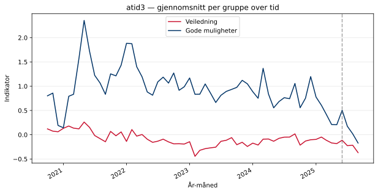
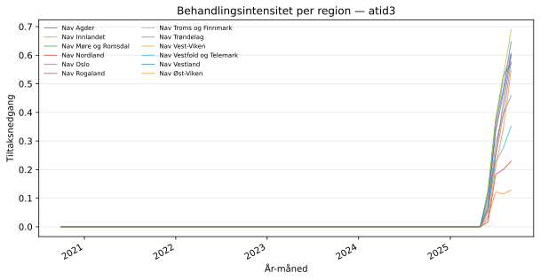
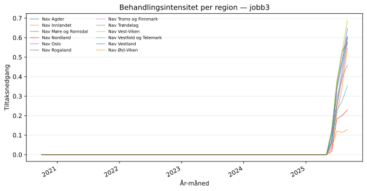

## Oversikt

Behandlet gruppe: **trenger-veiledning**  
Kontrollgruppe: **gode-muligheter**  
Analysenivå: **region**

## atid3

- Antall observasjoner: **1440**
- Antall regioner: **12**
- Antall enheter: **12**
- Antall måneder: **60**
- Behandlet gruppe (n): **720**
- Kontrollgruppe (n): **720**
- Gjennomsnittlig indikator (pre, behandlet): **-0.0834**
- Gjennomsnittlig indikator (pre, kontroll): **0.9725**

### Trender over tid — atid3

### Behandlingsintensitet — atid3

## jobb3

- Antall observasjoner: **1440**
- Antall regioner: **12**
- Antall enheter: **12**
- Antall måneder: **60**
- Behandlet gruppe (n): **720**
- Kontrollgruppe (n): **720**
- Gjennomsnittlig indikator (pre, behandlet): **0.0409**
- Gjennomsnittlig indikator (pre, kontroll): **2.8985**

### Trender over tid — jobb3

### Behandlingsintensitet — jobb3

