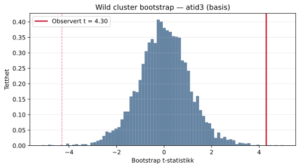
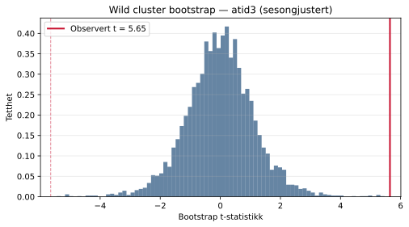
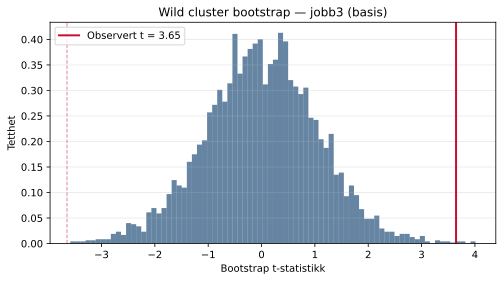
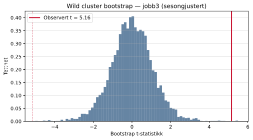

## Wild cluster bootstrap

Bootstrap-p-verdien er det primære inferensresultatet. Alle standardfeil 
er clustret på regionsnivå. Webb (6-punkt) vekter brukes for å håndtere 
det lave antallet clustere (G = 12).

### atid3 — basis

- Observert koeffisient: **1.3519**
- Observert SE: **0.3143**
- Observert t-statistikk: **4.301**
- Bootstrap p-verdi: **0.0014**
- Antall replikasjoner: **4999**

### atid3 — sesongjustert

- Observert koeffisient: **1.8358**
- Observert SE: **0.3252**
- Observert t-statistikk: **5.645**
- Bootstrap p-verdi: **0.0000**
- Antall replikasjoner: **4999**

### jobb3 — basis

- Observert koeffisient: **3.8037**
- Observert SE: **1.0431**
- Observert t-statistikk: **3.646**
- Bootstrap p-verdi: **0.0012**
- Antall replikasjoner: **4999**

### jobb3 — sesongjustert

- Observert koeffisient: **5.2169**
- Observert SE: **1.0117**
- Observert t-statistikk: **5.156**
- Bootstrap p-verdi: **0.0004**
- Antall replikasjoner: **4999**

