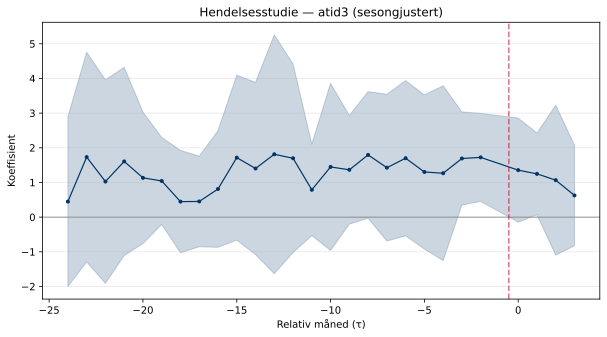
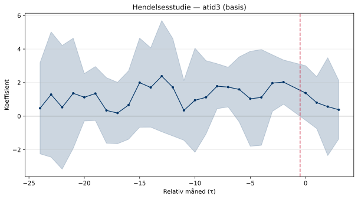
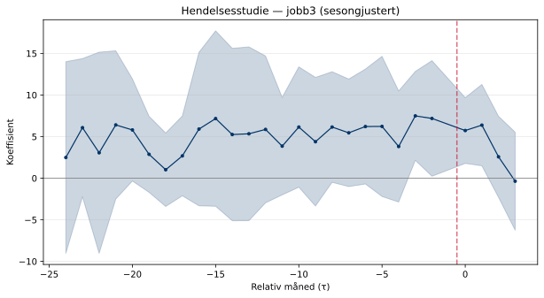
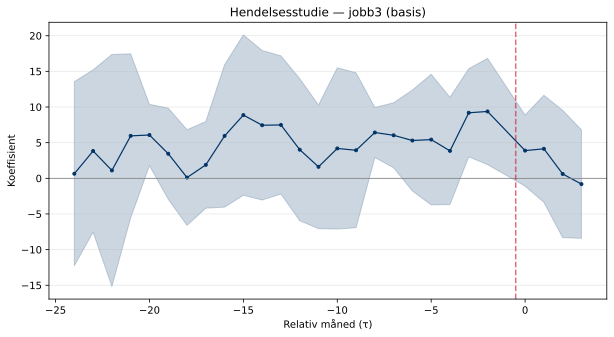
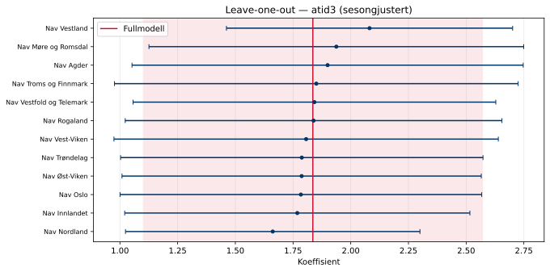
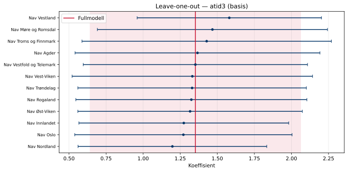
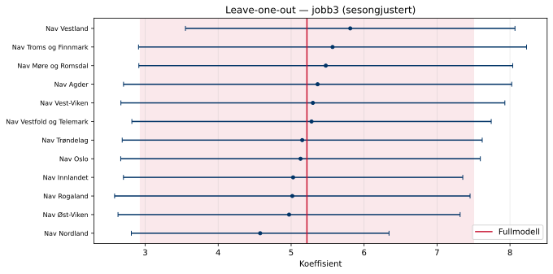
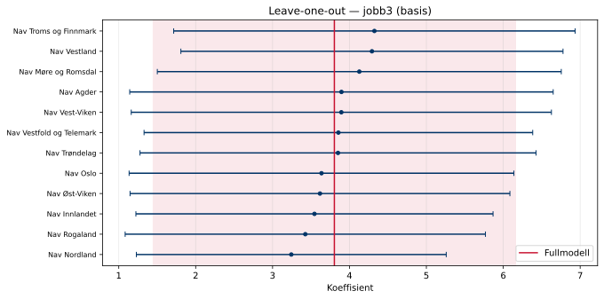

## Hendelsesstudie

Trippel-diff-hendelsesstudien interagerer regionens behandlingsintensitet 
med gruppeindikator og tidsperiode. Koeffisientene i pre-perioden bør være 
nær null under parallell-trendantagelsen.

### atid3 — sesongjustert

- Pre-trend F-test: F(10, 11) = 1.527, p = 0.2486

### atid3 — basis

- Pre-trend F-test: F(10, 11) = 9.414, p = 0.0005

### jobb3 — sesongjustert

- Pre-trend F-test: F(10, 11) = 2.475, p = 0.0765

### jobb3 — basis

- Pre-trend F-test: F(10, 11) = 7.255, p = 0.0015

## Placebotest

Placebo-analysen bruker en falsk behandlingsdato 12 måneder før den virkelige, 
og estimerer trippel-diff-modellen på pre-perioden. En nær-null koeffisient 
tyder på at parallell-trendantagelsen holder.

### atid3 — sesongjustert

- Koeffisient: **-2.3782*****
- SE: 0.6395
- p-verdi: 0.0034

### atid3 — basis

- Koeffisient: **-2.5985*****
- SE: 0.6225
- p-verdi: 0.0016

### jobb3 — sesongjustert

- Koeffisient: **-11.0353*****
- SE: 1.8311
- p-verdi: 0.0001

### jobb3 — basis

- Koeffisient: **-11.7304*****
- SE: 1.7429
- p-verdi: 0.0000

## Leave-one-out

Modellen re-estimeres med én region utelatt om gangen. 
Stabile koeffisienter viser at ingen enkeltregion driver resultatene.

### atid3 — sesongjustert

### atid3 — basis

### jobb3 — sesongjustert

### jobb3 — basis

